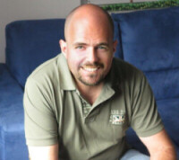

# About me

{ align=right }
I am an Italy-based consultant with years of experience with both big brands
and small business. I care about building solid and extensible designs, and
about writing good and readable code. Being a developer, I like to write tools
targeted to myself and to the others developers, to make our life easier. I
hold a Ph.D. and a Master Degree in Computer Science.

## Area of expertise and FOSS activity

I am primarly a Python and PyPy expert, although I have experience with lots
of other technologies, including .NET, Java, Android.

Notable projects:

  - Creator of [SPy](https://github.com/spylang/spy)
  - Co-founder of [HPy](https://hpyproject.org/)
  - Core developer of [PyPy](https://pypy.org/) for 15+ years.
  - Original creator of [`pdb++`](https://github.com/pdbpp/pdbpp/) (now
    maintained by others)

Moreover,I have also been very active in the Python community for years,
giving talks at various conferences such as EuroPython, PyCon Italia, PyCon US
and more.

## Methodology

Thanks to my experience with PyPy, I have a strong and positive experience
w.r.t. distributed, agile, sprint-driven and test-driven development,
including good communication skills through IRC and emails, the ability to
work from home and to be self-motivated to accomplish my goals.

## Contact

Feel free send me an [email](mailto:info@antocuni.eu).
