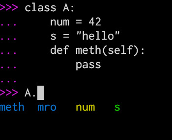

# Over the clouds: CPython, Pyodide and SPy

The Python community is awesome.

It is full of great people and minds, and interacting with people at
conferences is always nice and stimulating. But one of my favorite things is
that over time, after many conferences, talks, pull requests and beers, the
personal relationship with some of them strengthen and they become friends.

I am fortunate enough that two of them, Łukasz Langa and Hood Chatham, accepted my
invitation to join me in Cervinia, at the border between Italian and Swiss Alps,
for a week of hacking, winter sports and going literally over the clouds. This
is a brief summary of what we did during our time together.

<!-- more -->

## About us

Łukasz doesn't need much introduction, as he's one of the most visible
personalities of the Python world: among other things, he has been the
release manager of CPython 3.8 and 3.9, he is the creator of
[Black](https://black.readthedocs.io/) and these days is the [CPython developer
in residence](https://lukasz.langa.pl/a072a74b-19d7-41ff-a294-e6b1319fdb6e/).

Hood is mainly known for his work on [Pyodide](https://pyodide.org/),
which in my opinion is one of the most underrated projects in the Python
world: it allows us to run CPython in the browser by compiling CPython and
huge sets of extension modules to WebAssembly, using Emscripten. This may sound
easier than it is, because WebAssembly is a very weird and young platform,
meaning that over the years the Pyodide maintainers have had to develop
a considerable amount of patches to CPython itself,
Emscripten, LLVM, etc.  If you use any website or project which allows you to
run Python in the browser such as [PyScript](https://pyscript.net/), there is
a good chance it's actually Pyodide under the hood (pun intended 😅).

As for me, like many other Pythonistas, my name is associated with
many projects starting or ending (or both!) with "Py", like
[PyPy](https://pypy.org/), [HPy](https://hpyproject.org/) and PyScript.  A
couple of years ago I decided that all these Pys weren't enough, so I started
[SPy](https://github.com/spylang/spy), which is an experiment to see whether
we can come up with a Python variant which can be easily interpreted (for good
development experience) and compiled (for performance).  This is the
appropriate place to give a big thanks to
[Anaconda](https://www.anaconda.com/), which is allowing me to work on it full
time currently.

## Hacking

There is one thing which face-to-face pairing does and which is impossible to
achieve with async and remote collaboration: you can see all the little tricks
and tools which other people use in their daily hacking. On the first day,
Łukasz showed me the wonder of [Xonsh](https://xon.sh/), a multi platform
shell written and scriptable in Python.

{ align=right }

Likewise, very soon he noticed that whenever I pressed `TAB` at my Python REPL,
I'd get colored completions, thanks to
[fancycompleter](https://github.com/pdbpp/fancycompleter). This is a project
which I started ~15 years ago and I've used since then: at that time, it
couldn't work out of the box on CPython, because it required a patched version
of `libreadline`: but nowadays CPython ships with [pyrepl](https://docs.python.org/3/whatsnew/3.13.html#a-better-interactive-interpreter)
which _does_ support colored completions out of the box: with that in mind, we
thought that it could be a good idea to integrate it in CPython. The result of
this work ended up in
[PR #130473](https://github.com/python/cpython/pull/130473): it is still very
WIP but hopefully I'll be able to continue working on it in the next days or
weeks.

Meanwhile, Hood discovered that the latest version of Pyodide
[didn't work on iOS](https://github.com/pyodide/pyodide/issues/5428). In
perfect accordance to the spirit of the week, Łukasz promptly paired with him
to [fix the issue](https://github.com/pyodide/pyodide/pull/5445).

So, with this, we have PRs for two of our three projects. SPy is next in line,
but it deserves its own section.

## The first SPy program ever 🥸

SPy occupied a significant portion of our week. At the beginning of the week,
we dedicated time to explaining the fundamental concepts and design decisions
to Łukasz and Hood.

Quoting what I wrote above:

> SPy is an experiment to see whether we can come up with a Python variant
> which can be easily interpreted (for good development experience) and
> compiled (for performance).

Currently, the documentation is very scarce. The best source to understand the
ideas behind it are probably the
[slides](https://antocuni.pyscriptapps.com/spy-pycon-2024/latest/) and
[recording of the talk](https://www.youtube.com/watch?v=jrQy3xGjpsU&ab_channel=EuroPythonConference)
which I gave at PyCon and EuroPython.

Now, this is a perfect time for a big disclaimer:

!!! warning "Warning"
    SPy is in super early stage, not even alpha quality. It probably contains
    lots of bugs, the language design is not fully stabilized, many basic
    features are probably missing.

That said, SPy can already do interesting things. In particular, after I
showed the
[array example](https://github.com/spylang/spy/blob/018cd58c534480719bb22d3cfe026532e53c5942/examples/array.spy),
Łukasz realized that despite the immaturity, SPy is already good enough to
speed up one of his generative art projects.

He has already written an
[extensive post](https://lukasz.langa.pl/f37aa97a-9ea3-4aeb-b6a0-9daeea5a7505/)
about it, so I'm not going to repeat the full story here. Let me just quote a few intriguing excerpts to pique your interest in reading more:

!!! citation "&emsp;"
    Let’s get one thing out of the way. SPy is a research project in its early
    stages at the moment. You should not attempt to use it yet, unless you
    plan to contribute to it, and even then you have to come with the right
    mindset.
    [...]

    With all this in mind, SPy looks very attractive to me already. It’s a
    language designed to be friendly to Python users, but is not attempting to
    be Python-compatible. It can’t be, because with SPy, user code can be
    fully compiled to native binaries or WebAssembly.

!!! citation ""
    For the first end-user project in SPy, I decided to convert an existing
    Genuary entry I made with PyScript that draws an endless abstract
    topographic map.
    [...]

    This computation was too much for pure Python in either Pyodide or
    MicroPython to happen inside the animation loop, so in the original
    project I pre-computed the map area in a Web worker.
    [...]

    The SPy version of the project ditches the Web worker as **the computation
    is over 100X faster**. You’re literally waiting longer for the background
    audio file to load. The result looks exactly the same, which was an
    important metric for us.

Remember when we said that SPy still misses many basic features? Here is a
list of PRs that Łukasz had to make in order to achieve his goals:

  - [Add modulo operator for i32 #122](https://github.com/spylang/spy/pull/122)
  - [Add bitwise operators for i32 #123](https://github.com/spylang/spy/pull/123)
  - [Add post mortem to other exception types if --pdb was passed #124](https://github.com/spylang/spy/pull/124)
  - [Teach the C compiler about f64_to_i32 conversions #125](https://github.com/spylang/spy/pull/125)

Thanks to this, we also got Łukasz as a contributor to SPy. Only Hood was
left...

## SPy playground

The SPy interpreter is written in Python (for now... eventually, it will be
written in SPy itself), and Pyodide/PyScript makes it very easy to run Python
in the browser. The goal for Hood and me was to be able to run the SPy
interpreter on top of Pyodide, to make it easier for people to try it out.

This proved to be challenging because of the very peculiar way in which SPy
relies on WASM.  WebAssembly plays a central role in SPy, for two reasons:

  - compilation to .wasm is a first class feature (by converting .spy to .c and
    then invoking clang)

  - the interpreter uses [wasmtime](https://wasmtime.dev/) as a sandbox for
    SPy's application-level memory allocation

The latter point requires some extra explanation: SPy includes a special
"unsafe" mode that allows the use of low-level constructs like pointers and
structs. These constructs, while powerful, pose a risk of crashing the
interpreter due to their unsafe nature. To mitigate this risk, SPy executes
these unsafe portions within a WASM sandbox using `wasmtime`. This approach
ensures that any potential crashes are contained within the sandbox,
preserving the stability of the interpreter. Additionally, this system is
employed to call the runtime library, which is partially written in C. The C
code is compiled to WASM and subsequently loaded by `wasmtime`, providing a
secure and efficient execution environment.

Another nice aspect of this architecture is that you can instantiate
multiple SPy VMs in the same process, since all the state is stored in the
sandoxed WASM memory.

The challenging part is that `wasmtime` doesn't run on top of Pyodide. On the
other hand, Pyodide literally sits on top of another WASM engine, provided by
the browser and exposed by Emscripten.

With this in mind, Hood and I started a
[SPy branch called pyodide](https://github.com/hoodmane/spy/tree/pyodide): the
plan was to create a layer called
[llwasm](https://github.com/hoodmane/spy/tree/pyodide/spy/llwasm) to abstract
away the differences between `wasmtime` and Emscriptem, so that we could transparently use one or the other from the SPyVM.

This proved to be more challenging than expected, in part because the WASM API
exposed by Javascript/Emscripten is async, while the one exposed by wasmtime
is sync.  Anyway, after a few days of intense work we managed to have it
working 🎉, although the PR is not merged yet because it requires some
polishing.

With that, I could hack together a quick & dirty
[SPy playground](https://antocuni.pyscriptapps.com/spy-playground/latest/): it
is written with PyScript + [LTK](https://github.com/pyscript/ltk).  My web
design skills leave a bit to be desired, so improvements and PRs are totally
welcome. You can open it in an separate page to have it full screen, or you
can load the inline version below:

   <button id="load-spy-button" onclick="loadIframe()" style="
     background: #2575fc;
     color: white;
     padding: 12px 24px;
     font-size: 16px;
     font-weight: bold;
     border: none;
     border-radius: 8px;
     cursor: pointer;
     transition: transform 0.2s, box-shadow 0.2s;
     box-shadow: 0 4px 10px rgba(0, 0, 0, 0.2);
     ">
     Load SPy Playground
     </button>

The playground allows to see the effect of all the various passes of the SPy
pipeline:

  1. `--execute`: run the code in the SPy interpreter
  2. `--parse`: parse the code and dump the AST
  3. `--redshift`: perform redshifting
  4. `--cwrite`: convert redshifted code into C

There is the last missing step: compiling the generated C code to WASM, which is
currently not possible because it would require to run clang in the
browser. Again, if anybody has any idea on how to make it happen, PRs are
welcome.

## Conclusion

It has been a fun and productive week! While this post is rich in technical
details, I think it's important to highlight the value of personal
relationships and the joy of spending time together. A big thank you to Łukasz
and Hood for visiting!
