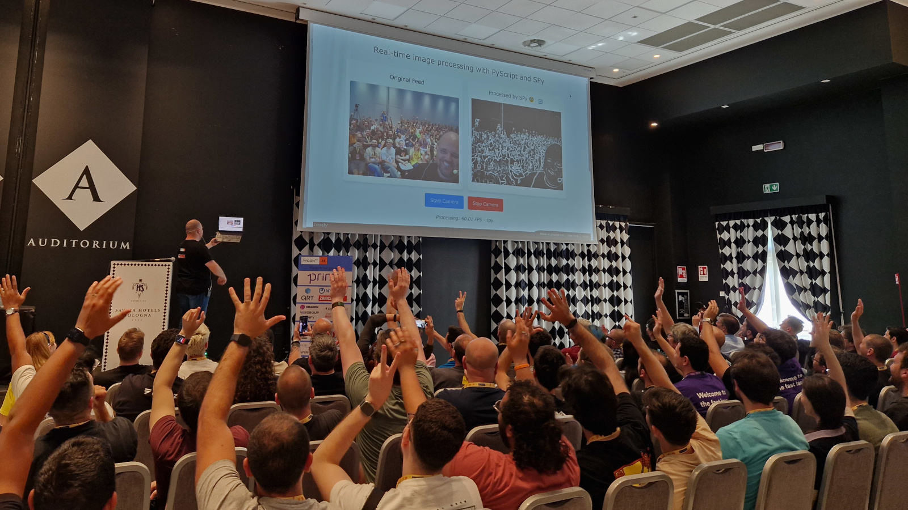

# SPy @ PyCon IT 2025

<meta property="og:title" content="SPy @ PyCon IT 2025">
<meta property="og:description" content="Slides of the talk">
<meta property="og:image" content="http://antocuni.eu/2025/05-spy-pycon-italy/selfie.jpg">
<meta name="author" content="Antonio Cuni">

Yesterday I talked about [SPy](https://github.com/spylang/spy) at [PyCon Italy](https://pycon.it/).

Thanks to [Hugo van Kemenade](https://github.com/hugovk) for the picture.

Slides are available [here](/talk/2025/05/spy-pycon-italy/).

The edited video is not available yet, but in the meantime it's possible to
watch unedited version available inside the
[live stream](https://www.youtube.com/live/pAnun46-fwE?si=gSMnf26TNHNSJkkO&t=20642)
at minute 05:44:05.

<!-- more -->

Other misc links:

  - [SPy on github](https://github.com/spylang/spy/)

  - [Real time image processing demo](https://antocuni.pyscriptapps.com/sobel/latest/)
