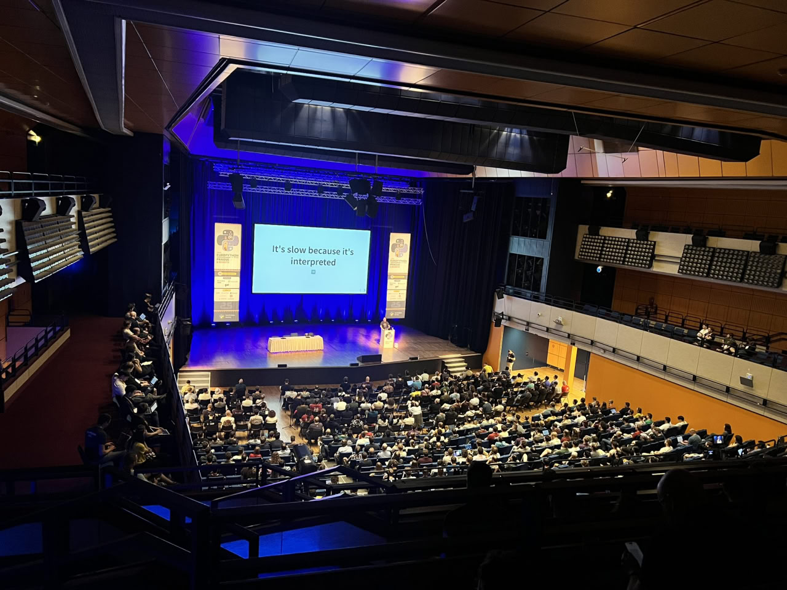

# EuroPython 2025 slides

Here are the slides for the three speeches which I gave at
[EuroPython 2025](https://ep2025.europython.eu/):

<!-- more -->

  - [The HPy dilemma](../../../talk/2025/07/capi-summit-hpy-dilemma/index.html): this was given
    during the
    [C API summit](https://ep2025.europython.eu/session/c-api-summit), as a
    personal retrospective of what went well and wrong during my years
    developing and promoting [HPy](https://hpyproject.org/)

  - [Updates from SPy land 🥸](../../../talk/2025/05/spy-wasm-summit/index.html): this was given
    during the
    [WebAssembly Summit](https://ep2025.europython.eu/session/webassembly-summit),
    and it's actually the same talk which I already gave at the same summit at
    PyCon US.  For a better in-depth explanation of SPy, I recommend my
    [PyCon Italy talk](../05-spy-pycon-italy/index.md) instead.

  - [Myths and fairy tales around Python performance](../../../talk/2025/07/europython-myths-and-fairy-tales/index.html):
    this was given during the main conference: it contains my thoughts about
    why Python is slow and fundamentally hard (or impossible) to optimize.

Thanks to [Anastasiia Tymoshchuk](https://x.com/anastasiatymo) for the picture.
