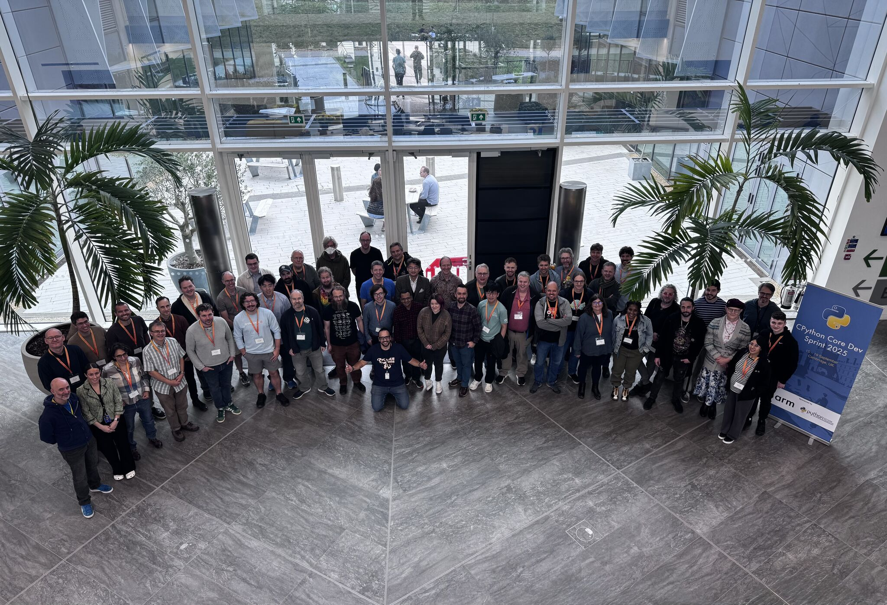

# Tracing JITs in the real world @ CPython Core Dev Sprint

<meta property="og:title" content="Tracing JITs in the real world @ CPython Core Dev Sprint">
<meta property="og:description" content="My experience at the CPython Core Dev Sprint">
<meta property="og:image" content="http://antocuni.eu/2025/09-tracing-jit-real-world-python/cpython-core-dev-sprint-2025-cambridge.jpg">
<meta name="author" content="Antonio Cuni">

<style>
.slide {
  border: 2px solid #ddd;
  border-radius: 8px;
  margin: 2em 0;
  background: #f9f9f9;
  max-width: 100%;

  /* Slide content box */
  aspect-ratio: 16 / 9;
  box-sizing: border-box;
  padding: 2em;
  background: white;
  border-radius: 6px 6px 0 0;
  border-bottom: 2px solid #eee;
  display: block;
  width: 100%;
}

.slide h1, .slide h2, .slide h3 {
  margin-top: 0;
  color: #333;
}
</style>

Last week I got to take part in the CPython Core Developer Sprint in
Cambridge, hosted by ARM and brilliantly
[organized by Diego Russo](https://www.linkedin.com/posts/diegor_yesterday-we-wrapped-up-thecpython-core-activity-7375230888177057792-GezI)
-- about ~50 core devs and guests were there, and I was excited to join as one
of the guests.



I had three main areas of focus:

  - **C API**: this was a follow up of what we discussed at the
    [C API summit at EuroPython](../07-europython-talks/index.md). The current
    C API is problematic, so we are exploring ideas for the development of
    [PyNI](https://github.com/py-ni) (Python Native Interface), whose design
    will likely be heavily inspired by [HPy](https://hpyproject.org/). It's
    important to underline that this is just the beginning and the entire
    process will require multiple PEPs.

  - **fancycompleter** This is a
    [small PR](https://github.com/python/cpython/pull/130473) which I started
    [months ago](../02-over-the-clouds/over-the-clouds.md), to enable colorful
    tab completions within the Python REPL. I wrote the original version of
    [fancycompleter](https://github.com/pdbpp/fancycompleter) 15 years ago,
    but colorful completions work only in combination with PyREPL. Now PyREPL
    is part of the standard library and enabled by default, so we can finally
    upstream it. I hope to see it merged soon.

  - "**JIT stuff**": I spent a considerable amount of time talking to the
    people who are working on the CPython JIT (in particular Mark, Brandt,
    Savannah, Ken Jin and Diego). Knowledge transfer worked in both ways: I
    learned a lot about the internal details of CPython's JIT, and conversely I
    shared with them some of the experience, pain points and gut feelings
    which I got by working many years on PyPy.

In particular, on the first day I presented a talk titled **Tracing JIT and real world Python** ([slides](../../../talk/2025/09/core-dev-sprint-pypy-jit/index.html) and [source code](https://github.com/antocuni/antocuni.github.io/tree/main/blog/talk/2025/09/core-dev-sprint-pypy-jit)).

What follows is an annotated version of the slides.

<!-- more -->

---
<div class="slide" markdown="1">
## Tracing JIT and real world Python

### aka: what we can learn from PyPy
</div>

---
<div class="slide" markdown="1">
# Motivation

- CPython's JIT has a lot in common with PyPy

- "Optimize for PyPy" ==> my job for ~7 years

- Real world code != pyperformance

- Challenges & lessons learned
</div>

CPython's new JIT and PyPy's JIT share fundamental similarities, as they're both
tracing JITs.

I spent ~7 years of my career optimizing existing code for PyPy at a
high-frequency trading firm, and I realized that I'm probably one of the few
people in the world with actual experience in optimizing real world Python
code for a tracing JIT.

I expect that some of the challenges which I faced will still be valid also
for CPython, and I wanted to share my experience to make sure that CPython
core devs are aware of them.

One lesson which I learned is that the set of benchmarks in `pyperformance` are
a good starting point, but they are not entirely representative of what you
find in the wild.

The main goal of the talk is not to present *solutions* to these problems,
but to raise awareness that they exist.

---
<div class="slide" markdown="1">
Assumption

- The JIT revolutionizes performance characteristics

- CPython perf will look like PyPy's

- ==> Some results are surprising
</div>

Until now CPython's performance has been particularly predictable, there are
well established "performance tricks" to make code faster, and generally
speaking you can mostly reason about the speed of a given piece of code
"locally".

Adding a JIT completely changes how we reason about performance of a given
program, for two reasons:

  1. JITted code can be very fast if your code conforms to the heuristics
     applied by the JIT compiler, but unexpectedly slow(-ish) otherwise;

  2. the speed of a given piece of code might depend heavily on what happens
     elsewhere in the program, making it much harder to reason about
     performance locally.

The end result is that modifying a line of code can significantly
impact seemingly unrelated code. This effect becomes more pronounced as the
JIT becomes more sophisticated.

The CPython JIT is still pretty new and doesn’t give huge speedups yet. I
expect that as it gets faster, its performance will start looking more and
more like PyPy’s.

---
<div class="slide" markdown="1">
# Context

- High Frequency Trading firm (sport betting)

  * every ms counts

- Python 2.7

- Multi process system: stateful server + dispatcher + stateless workers (long-running processes)

- "big" messages passed around
</div>

---
<div class="slide" markdown="1">
## PyPy JIT 101

- Interpreter written in RPython

- RPython -> `*.c` -> gcc -> `./pypy`

- RPython -> "jit codegen" -> "jitcodes" (~RPython IR)

- RPython jitcodes ~= CPython microops

  * Slightly higher level than C

- Tracing means *executing jitcodes*

  * we have an interpreter for that, super slow
</div>

I delivered this talk at the Core Dev Sprint: I expected my audience to be
familiar with CPython's JIT, and wanted to draw parallels with PyPy's one.

Since the audience of this blog is different, let me **briefly** explain
CPython's JIT first.

The explanations of both JITs are necessarily short, incomplete and highly
simplified.

#### CPython JIT 101

Python source code is turned into bytecode. Bytecode is a sequence of
"opcodes" (`LOAD_FAST`, `BINARY_OP`, etc.), and the CPython VM is an
interpreter for those opcodes. Historically the VM was written by hand, and the
main loop consisted of a big `switch` statement which executed the code
corresponding to each opcode.

Nowadays things are different: the opcodes are written in a special DSL and
the main interpreter loop is generated from this
DSL. Additionally, the DSL describes how each opcode can be decomposed into
multiple "microops".

When the interpreter detects a "hot loop", it starts the JIT. The JIT
retroactively looks at the opcodes which were executed in the last iteration
of the loop, and creates a "linear trace" which contains the equivalent
microops. This process is called **trace projection** and the result is an
unoptimized trace of microops.

Then, the JIT can produce an optimized trace, by reordering and removing
redundant microops. Finally, the optimized trace is turned into executable
code using the "copy & patch" technique.

#### PyPy JIT 101

CPython's Python interpreter is written in C, and then compiled into an
executable by `gcc` (or any other C compiler).

Similarly, PyPy's Python interpreter is written in RPython, and then compiled
into an executable by `rpython`.

Under the hood, `rpython` applies two separate transformations to the source
code:

  - it turns each function into C code, which is then fed to `gcc` to get the
    final executable;

  - it turns each function into "jitcodes", which is a way to represent
    RPython's IR (internal representation). For each RPython function, the
    final `./pypy` executable contains its compiled representation (generated
    by GCC) **and** its jitcode representation (embedded as static data into the
    executable).

In a way, RPython's jitcodes are equivalent to CPython's microops, as they are
a low-level representation of the logic of each opcode.

When the interpreter detects a hot loop, it enters **trace recording** mode,
which is essentially an interpreter which executes the jitcodes: the result is
a linear unoptimized trace of all the jitcodes which were actually executed.

Similarly to CPython, PyPy then produces an optimized trace, which is then
sent to the JIT backend for actual native code generation.

---
<div class="slide" markdown="1">
### Problem 1: trace blockers

```python
def get_pi():
    """
    Compute an approximation of PI using the Leibniz series
    """
    tol = 0.0000001
    pi_approx = 0.0
    k = 0
    term = 1.0  # Initial term to enter the loop

    while abs(term) > tol:
        if k % 2 == 0:
            term = 1.0 / (2 * k + 1)
        else:
            term = -1 * 1.0 / (2 * k + 1)

        pi_approx = pi_approx + term
        k = k + 1


    return 4 * pi_approx
```

</div>

Tracing JITs work by recording a trace of all microops which are
executed. The optimizer can then reason about what happens in the trace and
remove unneeded operations.

However, sometimes we encounter some operation which is a black box from the
point of view of the tracer: we call them "trace blocker", because the tracing
JIT cannot see through them.  In the case of CPython, this happens for
example, whenever we call any function implemented in C (because it doesn't
have any correspondent "microop").

This is a simple function that computes `pi`, generated by ChatGPT.  Its
precise content is not important: what matters is that it's a nice purely
numerical loop that the PyPy JIT can optimize very well.

---
<div class="slide" markdown="1">

### Problem 1: trace blockers

```python
def get_pi():
    """
    Compute an approximation of PI using the Leibniz series
    """
    tol = 0.0000001
    pi_approx = 0.0
    k = 0
    term = 1.0  # Initial term to enter the loop

    while abs(term) > tol:
        if k % 2 == 0:
            term = 1.0 / (2 * k + 1)
        else:
            term = -1 * 1.0 / (2 * k + 1)

        pi_approx = pi_approx + term
        k = k + 1
        hic_sunt_leones() # <<<<<<<<<<<< the JIT cannot enter here

    return 4 * pi_approx
```

</div>

Same function as above, with a call to `hic_sunt_leones()`. This is actually
an **empty function** which does absolutely nothing, but annotated in a
special way so that the PyPy JIT cannot "enter" it, so it effectively behaves
as trace blocker.

---
<div class="slide" markdown="1">
## Hic sunt leones

```python
def empty():
    pass      # the JIT cannot enter here

def hic_sunt_leones():
    pypyjit.residual_call(empty)
```

- Any call to non-traceable function

- C builtins, C extensions

- (for PyPy): RPython instructions not understood by the JIT
</div>

In this example we use the special `pypyjit.residual_call` to simulate a trace
blocker, but in real life we get it whenever we have a call to any
non-traceable function, in particular C extensions.

---
<div class="slide" markdown="1">
```
❯ python3.13 pi.py
2.1712 secs, pi = 3.1415928535897395

❯ pypy pi.py
0.0518 secs, pi = 3.1415928535897395

❯ # with "hic_sunt_leones()"
❯ pypy pi.py
1.1808 secs, pi = 3.1415928535897395
```
</div>

The clean version runs 42x faster on PyPy than CPython - that's the JIT
working perfectly. But with just one untraceable function call added to the
loop, PyPy slows down to only 1.8x faster than CPython. That single line
destroyed most of the JIT's effectiveness!

This happens because after the call the optimizer no longer knows whether its
assumptions about the world are still true, and thus must be much more
conservative.

I fear that for CPython, this will turn out to be a much bigger problem than
for PyPy, for two reasons:

  1. nowadays it's virtually impossible to run Python code without
     using any C extension, either directly or indirectly.

  2. by construction, PyPy's JIT can see much more than CPython's
     JIT. Remember the slide about "jitcodes": any RPython function gets a
     "jitcodes" equivalent, which means that the JIT can automatially trace
     inside builtins and internals of the interpreter, whereas CPython can
     trace only inside pure python code.

For example, PyPy's JIT can trace through `range()`, `zip`, and `enumerate()`
automatically. CPython's JIT currently cannot because they are implemented in
C. CPython *could* add special cases for these common functions, but the
general approach doesn't scale.


---
<div class="slide" markdown="1">
### Problem 2: data driven control flow

```python
def fn(v=None, a=None, b=None, c=None, d=None, e=None, f=None, g=None, h=None):
    "Random nonsense computation generated by ChatGPT"
    if v is None: v = 0
    if a is None: a = 1.25
    if b is None: b = -0.75
    [...]
    y = a * v + b
    if y < f: y = f
    [...]
    return y

def main():
    [...]
    for row in DATA:
        acc += fn(*row)
```
</div>

The second big problem is what I call "data driven control flow". This example
has been autogenerated by ChatGPT and it's completely silly, but it's a good
representation of what happens in real life code.

In this example, `fn` takes 9 variables, each of them can be `None` or a
number. The function starts with a sequence of `if <var> is None: ...`. The
function is then called repeatedly in a loop.

One of the assumption of tracing JITs is that control flow tends to stay on
the "hot path", and that it's enough to optimize that to get good performance.

But in a case like this, each combination of `None`ness selects a different
path, and if we assume the data is evenly distributed, we find out that
**there is no hot path**.

Let's see what happens when we execute on CPython and PyPy:


---
<div class="slide" markdown="1">
### Problem 2: data driven control flow

```
❯ python3.13 data_driven.py
0.1274 secs

❯ pypy --jit off data_driven.py
0.2953 secs

❯ pypy data_driven.py
1.6414 secs
```
</div>

PyPy without JIT is "only" 2.3x slower than CPython, but when we enable the
JIT, it becomes **much worse**. This happens because of an exponential
explosion of code paths seen by the JIT.

In a normal compiler, an `if` statement is compiled as a diamond, and the
control flow merges after each `if`:

```
        if a is None
          /   \
         /     \
      a = 0    pass
         \     /
          \   /
        if b is None
          /   \
         /     \
      b = 0    pass
         \     /
          \   /
           ...
```

A tracing JIT by definition follows what's happening during a concrete
execution, so it sees only a concrete path in the control flow, with "guards"
to ensure correctness:

```
        guard(a is None)
          /
         /
      a = 0
         \
          \
   guard(b not None)
          /
         /
      b = 0
         \
          \
          ...
```

When `guard(a is None)` fails enough times, we create a "bridge" and record
another linear trace, following again the *concrete control flow* that happens
now:

```
          guard(a is None) ----> FAIL (side exit)
            /                         \
           /                           \
        a = 0                          pass
           \                             \
            \                             \
    guard(b not None)              guard(b not None)
            /                             /
           /                             /
        b = 0                         b = 0
           \                             \
            \                             \
           ...                           ...

```

Note how `b = 0` is effectively duplicated now. By design, PyPy's JIT *never
merges execution flow*.


---
<div class="slide" markdown="1">
## Exponential tracing

- Every combination of "`None`ness" must be compiled separately

```
❯ PYPYLOG=jit-summary:- pypy data_driven.py
1.6387 secs
[a625ea04910] {jit-summary
...
Total # of loops:	11
Total # of bridges:	527
...
[a625ea507bc] jit-summary}
```
</div>

Looking inside `PYPYLOG` confirms our theory: we get "exponential
tracing". The JIT has to compile separate optimized code for every unique
combination of which parameters are None and which aren't. With 9 parameters,
that could be up to 512 different combinations!


---
<div class="slide" markdown="1">
## Exponential tracing

- Mitigation: branchless code

```
if x < 0:
   x = 100
# ===>
x = (x < 0)*100 + (x >= 0)*x
```

- Ugly, unreadable, not always possible

- Never found a good solution

- Happens quite a lot

- *Fundamental problem of tracing JITs*?
</div>

One possible mitigation is to rewrite conditional code to be "branchless" -
using arithmetic tricks instead of if statements. But this makes code ugly and
unreadable, and it's not always possible.

Despite years of working on this, I never found a really good solution. There
were cases in which we had to continue running some piece of code on CPython
because I never managed to make the PyPy version faster.

This pattern happens quite a lot, although often is more subtle: in this silly
example all the `if`s are nicely grouped together at the start, but in a long
trace they can be scattered in multiple places, and _any_ kind of control flow
contributes to the problem, not only `if`s. In Python, this includes any kind
of dynamic dispatch, exceptions, etc.

One possible solution for CPython's JIT is to try to merge (some) traces to
avoid or limit the exponential explosion. However, it is worth underlining that
tracing JITs shine precisely when they can optimize a long linear trace: if
you try to compile shorter traces, you might quickly end up in a situation
which is equivalent to the "trace blocker" problem described earlier.

I suspect this might be a fundamental limitation of tracing JITs.

---
<div class="slide" markdown="1">
### Problem 3: generators (and async?)

```python
def count_triples_loop(P):
    """
    Counts how many integer right triangles (Pythagorean triples) have perimeter <= P.
    """
    m_max = int(math.isqrt(2 * P))  # loose but safe upper bound for m
    count = 0
    for m in range(1, m_max + 1):
        for n in range(1, m_max + 1):
            if ((m - n) & 1) and math.gcd(m, n) == 1:
                p0 = 2 * m * (m + n)  # a+b+c
                if p0 > P:
                    continue
                count += P // p0
    return count
```
</div>

Compared to the other two problems, this is less serious, but it's worth
mentioning because of prevalence of `async` (and thus implicitly generators)
in modern Python.

Here's another silly function that counts Pythagorean triples using nested
loops. This is our baseline version using plain loops.

---
<div class="slide" markdown="1">
### Problem 3: generators (and async?)

```python
def range_product(a, b):
    for i in range(*a):
        for j in range(*b):
            yield i, j

def count_triples_gen(P):
    m_max = int((math.isqrt(2 * P)))
    count = 0
    for m, n in range_product((1, m_max + 1), (1, m_max + 1)):
        if ((m - n) & 1) and math.gcd(m, n) == 1:
            p0 = 2 * m * (m + n)  # a+b+c
            if p0 > P:
                continue
            count += P // p0
    return count
```
</div>

Here's the same algorithm refactored to use a generator function for the
nested iteration. The "state of iteration" is implicitly stored inside the
local variables of frame object associated to the `range_product` generator.


---
<div class="slide" markdown="1">
### Problem 3: generators (and async?)

```python
class RangeProductIter:

    def __init__(self, a, b):
        self.i, self.n = a
        self.j, self.m = b

    def __iter__(self):
        return self

    def __next__(self):
        if self.i >= self.n:
            raise StopIteration
        value = (self.i, self.j)
        self.j += 1
        if self.j >= self.m:
            self.j = 0
            self.i += 1
        return value
```
</div>

Here's the same functionality implemented as a traditional iterator class. The
"state of iteration" is explicitly stored as attributes of `RangeProductIter`.


---
<div class="slide" markdown="1">
### Problem 3: generators (and async?)

```
❯ python3.13 pythagorean.py
loop: 0.4560 secs (1x)
gen:  0.5884 secs (1.29x)
iter: 1.0126 secs (2.22x)

❯ pypy pythagorean.py
loop: 0.1199 secs (1x)
gen:  0.1550 secs (1.29x)
iter: 0.1264 secs (1.05x)
```

- Generators force to create a frame

- The JIT cannot see "through" generators

- In real code, much worse slowdowns
</div>
On CPython, the generator version is ~29% slower than the explicit loops. The
iterator class is much slower, as one would intuitively expect.

However, on PyPy we see different results: `RangeProductIter` is basically
same speed as the baseline, while the generator version is slower. This
happens because in the case of `RangeProductIter` the JIT is able to see the whole
lifetime of the object and optimize it away entirely: instance variables
become local variables, the call to `__next__` is inlined and we get the
equivalent of explicit nested loops.

However, generators are *required* to create a frame object and represent a
fundamental case in which the JIT cannot trace through them effectively. In
more complex real-world scenarios, we saw much worse slowdowns than these
examples show.

---
<div class="slide" markdown="1">
## Other misc problems

- Tooling, profilers

- Warmup

- Performance instability

    * [Virtual Machine Warmup Blows Hot and Cold](https://arxiv.org/abs/1602.00602) (paper)

- Long tail of jitting

    ```
    for n in itertools.count():
       job = accept_job()
       do(job)
       if n > 12345:
           pypyjit.disable()
    ```
</div>

This is a collection of other miscellaneous problems that I had to deal with. Generally
speaking, we lack good support for tooling and profilers. CPython needs to
have a good story to explain people how to understand what's happening when
the JIT is enabled.

Warmup is another big problem: in PyPy, very short programs tend to be slower
than CPython because JITting costs. Moreover warmup is not an easily definable
phase, as the linked paper shows.  This is an area where currently CPython
shines, as its JIT is very fast.  I think that it will become slightly slower
when it tries to optimize more aggressively, but hopefully warmup will
overall be a lesser problem than on PyPy.

Moreover, it's very easy to accidentally make your code 2x, 5x or even 10x
slower by changing seemingly innocent pieces of code. This is another reason
why good tooling is essential.

Finally, the "long tail of JITting": every loop and every guard gets a
counter, and we start JITting when it reaches a threshold. Given a
sufficiently long running program, all counters reach the threshold eventually
and we end up JITting much more than necessary, using too much memory and/or
thrashing the cache. In many cases I found beneficial to just disable the JIT
"after a while", with manually tuned heuristics.

---
<div class="slide" markdown="1">
## Bonus slides

### (Avoid) allocations is all your need
</div>

These are slides which I didn't show during the live presentation, and show a
case where a tracing JIT can shine: since the JIT sees a complete trace of an
entire loop (including nested calls) it can easily removes a lot of temporary
objects which usually penalize Python performance.

In many cases, we can get the famous "zero-cost abstractions".

---
<div class="slide" markdown="1">
### Task

- Compute center of gravity of a series of triangles serialized according to a binary
  protocol

- Simulate protobuf, capnproto, etc.

```c
struct Point {
    double x;
    double y;
};

struct Triangle {
    Point a;
    Point b;
    Point c;
};
```
</div>

Let's look at a concrete example. We need to compute the barycenter of
triangles that are serialized in a binary format. Each triangle has three
points, each point has x and y coordinates. This simulates real world
protocols such as protobuf, capnproto, etc.

---
<div class="slide" markdown="1">
### Bare loop

```python
def read_loop():
    fmt = 'dddddd'
    size = struct.calcsize(fmt)
    tot_x = 0
    tot_y = 0
    n = 0
    with open('poly.bin', 'rb') as f:
        while True:
            buf = f.read(size)
            if not buf:
                break
            points = struct.unpack_from(fmt, buf)
            ax, ay, bx, by, cx, cy = points
            tot_x += (ax + bx + cx)
            tot_y += (ay + by + cy)
            n += 1

    print(n)
    x = tot_x/n
    y = tot_y/n
    return x, y
```
</div>

This is what we use a a baseline: a bare loop, using `struct.unpack_from` to read 6 floats at a time.

---
<div class="slide" markdown="1">
### Schema-aware protocol

```python
class Triangle:
    def __init__(self, buf, offset):
        self.buf = buf
        self.offset = offset

    @property
    def a(self):
        return Point(self.buf, 0)

[...]

class Point:
    def __init__(self, buf, offset):
        self.buf = buf
        self.offset = offset

    @property
    def x(self):
        return struct.unpack_from('d', self.buf, self.offset)[0]
```
</div>

Here's the "proper" object-oriented approach, similar to how modern
serialization libraries work. We create `Triangle` and `Point` classes that
provide a nice API for accessing the binary data. Each property access creates
new objects and calls struct.unpack_from. This is much more readable and
reusable, but creates many temporary objects.


---
<div class="slide" markdown="1">
### Schema-aware protocol

```python
        while True:
            buf = f.read(size)
            if not buf:
                break
            t = Triangle(buf, 0)
            tot_x += t.a.x + t.b.x + t.c.x
            tot_y += t.a.y + t.b.y + t.c.y
            n += 1
```
</div>

Here's how you'd use the object-oriented API. The code is much cleaner and
more readable than the bare loop version. But notice how many object creations
are happening: one `Triangle` object, six `Point` objects, plus all the
intermediate tuples from `struct.unpack_from`.


---
<div class="slide" markdown="1">
```
❯ python3.13 readpoly.py
read_loop:     0.5444 secs
read_proto:    3.0307 secs

❯ pypy readpoly.py
read_loop:     0.2945 secs
read_proto:    0.1183 secs
```
</div>

As expected, on CPython `read_proto` is much slower than the bare one,
roughly 6x slower. However, PyPy can fully optimize away all the
abstraction overhead introduced by `Triangle` and `Point`.

In PyPy jargon we call this form of allocation removal "virtuals" (because we
create "virtual objects" whose fields are represented as local variables) and
it's probably the single most important optimization that PyPy does.

During my week in Cambridge I talked extensively with the CPython JIT devs
about this and I hope I convinced them that this is what they should aim for
😊.

Note also that `read_proto` is actually **faster** than `read_loop`. This
happens because in `read_loop` we do a single `struct.unpack_from('dddddd', ...)`,
while in `read_proto` we do a succession of six individual
`struct.unpack_from('d', ...)`. It turns out that the JIT is able to trace
into the second form but not into the first, which means that in `read_loop`
we actually need to allocate a pseudo-tuple at each iteration.

The funny part is that **I did not expect** to get this result. I had to take
the time to analyze the JIT traces of both versions to understand why
`read_loop` was slower.  This is probably the best explanation of how
counterintuitive it is to reason about performance in a JITted world.

## Acknowledgments

Thanks to [Carl Friedrich Bolz-Tereick](https://cfbolz.de/) and
[Hood Chatham](https://github.com/hoodmane) for feedback on the slides and the
post.
