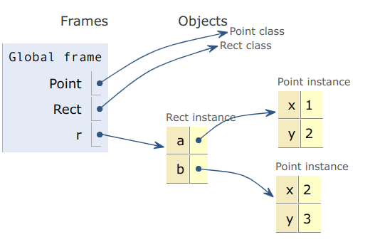

# Inside SPy🥸, part 1: Motivations and Goals

This is the first of a series of posts in which I will try to give a deep explanation of
[SPy](https://github.com/spylang/spy), including motivations, goals, rules of the
language, differences with Python and implementation details.

This post covers motivations and goals, but first we need to answer a question: what is
SPy?

<!-- more -->

## What is SPy?

There are multiple answers to that, depending on the point of view. The most technically
accurate is:

> SPy is an interpreter _and_ a compiler for a **statically typed variant** of Python,
> with focus on performance.

I think it's very important to be clear and honest since the beginning: SPy is not a
"compiler for Python". There are features of the Python language which will never be
supported by SPy by design. Don't expect to compile Django or FastAPI with SPy.

A small corollary is that for now I decided that SPy programs live in `*.spy` files, to
make the distinction between the two worlds very clear.

Whilst compiling 100% of Python is not a goal, SPy still aims to have a very tight
integration with the existing Python ecosystem.  It is possible to `import` Python
libraries from SPy, and SPy modules from Python.

!!! note "The myth of 100% compatibility"
    The vast majority of "compilers for Python" which exists or existed in the past are
    not "100% compatible". They don't support the full language even when they claim
    so. SPy prefers to be more explicit and honest about it.

!!! tip "Current Status"
    SPy is still very work-in-progress and there are many things which are part of the
    plan and the design, but they are currently not there.

    To make reading easier in this series I always use the present tense when talking
    about SPy capabilities -- even when they are not implemented -- and defer a more
    detailed explanation to these "Current Status" boxes.

    At this point, SPy is still not usable for anything bigger than demos. The most
    complex piece of code written in SPy is probably the
    [raytracing example](https://github.com/spylang/demos/tree/main/raytracing), which is
    **200x faster than CPython**.


!!! tip "Current Status: Python integration"
    At the moment of writing, SPy cannot import Python libraries yet.  The plan is to
    support this use case by embedding `libpython.so` (only if and when needed!) but to
    do that we need a way to call C from SPy, which we haven't yet.

    The other direction is partially supported: the SPy compiler can generate CFFI-based
    extensions which can be imported by CPython.  This is useful for experimentation and
    for early testing, but it exposes only a partial and low-level API.  Eventually, the
    SPy compiler will be able to generate fully fledged CPython extensions, similar to
    what Cython does.


Another possible answer is the following:

> SPy is a thought experiment to determine how much dynamicity we can remove from Python
> while still feeling Pythonic.

During the years there have been many attempts to improve Python speed; generally they
fall into two categories:

  1. Implement "full Python". To be able to support all dynamic features and be fast,
     they usually employ a JIT compiler. Examples are PyPy, GraalPy, Pyston, Unladen
     Swallow, etc.

  2. Implement a "subset of Python" or "variant of Python", often with an Ahead of Time
     (AOT) compiler which is able to produce fast code. The usual approach here is to
     remove many (if not all) of the dynamic features which make Python hard to
     compile.


!!! note "Subset vs Variant"

    If a compiler implements a **subset** of Python, then all programs which can be
    compiled can also run on top of CPython. If the compiler also add new features which
    are not available on CPython, then it's a **variant**.

    For example according to this definition, RPython is a subset and Cython is a
    variant.  SPy is also a variant because it offers unique features, as we will see
    later.


The problem of JIT compilers is that sometimes they work very well and produce huge
speedups, other times they don't produce any speedup at all, or might even introduce
slowdowns, or they might use too much memory, or they are slow to "warm up".

The problem of the AOT approach is that by removing the dynamic features of Python, you
end up with something which does not feel *pythonic*, and in which many typical and
idiomatic python patterns just don't work.  You often end up with "Java with Python
syntax" (nothing in particular against Java, but I hope it gives an idea of what I
mean).

SPy does something different: on one hand, it removes the dynamic features which make
Python "slow", but on the other hand it introduces *new* features which make it
possible to implement and use the same pythonic patterns which we like.  How to achieve
this result is not possible to explain in a few sentences, that's why we need a full
series of posts :).

## The Zen of SPy

As said above, 100% compatibility with Python is explicitly not a goal.

If you are a "language nerd" (like me :)) who knows the inner details of the
[attribute lookup logic](../08-cpython-attribute-lookup/index.md) or when Python invokes
`__add__` or `__radd__` in case of inheritance from builtin types, then SPy is
definitely **not Python**, and doesn't even try to be.

**However**, I expect that for a large fraction of Python users, it will not
matter. There are many users who mainly consume complex libraries written by others and
write "straightforward" Python code: for them, writing SPy should be as easy as writing
Python.

The following is a list of goals and design guidelines of SPy:

  1. **Easy to use and implement**. The language is easy to understand. It must be
     possible to implement SPy without huge engineering teams.

  2. We have an **interpreter** for ease of development and debugging.

  3. We have a **compiler** for deployment and performance. The interpreter and the
     compiler are guaranteed to produce the exact same results at runtime.

  4. **Rich metaprogramming capabilities**. SPy has 1st class support for
     metaprogramming, although the precise spelling and characteristics might deviate
     from CPython.  For example, it would totally be possible to recreate something like
     FastAPI or SQLAlchemy in SPy.

  5. **Performance matters**. SPy aims to have performance comparable to low level
     languages such as C and Rust.

  6. **Predictable performance**. We should be able to reason about the performance
     characteristics of a piece of code, without relying on a "magical optimizer" which
     we don't fully understand, and without having "performance cliffs" in which
     modifying a line of code makes everything 10x slower.

  7. **Zero cost abstractions**. SPy supports things like decorators, `**kwargs`, the
     descriptor protocol, `__getattr__`, etc. without extra runtime costs.

  8. **Static typing**. Type annotations are enforced by the language and checked by
     both the interpreter and the compiler.

  9. **Opt-in dynamism**. Some of the dynamic features of Python are off by default, but
     it's still possible to opt-in explicitly, when needed.  As an example, SPy provides
     a `dynamic` type which provides full dynamic dispatch.

 10. **One language, two levels**. SPy supports the low-level capabilities of C, C++,
     Rust, etc., as well as the high-level abstractions and expressivity of Python. For
     example, SPy's own
     [list](https://github.com/spylang/spy/blob/9b3bbf42a8a1426008de14c884536451f2ae9025/stdlib/_list.spy)
     and
     [dict](https://github.com/spylang/spy/blob/9b3bbf42a8a1426008de14c884536451f2ae9025/stdlib/_dict.spy)
     types are written in SPy.


!!! tip "Current Status: `**kwargs` and `dynamic`"
    At the time of writing, `**kwargs` and keyword arguments are not implemented yet.
    The `dynamic` type works in the interpreter, but not yet in the compiler.


## Motivations and background

There are several factors which motivated me to start such an ambitious project. Some of
them come directly from my first hand experience as a PyPy core dev in the last ~20
years.  Others come from insights which I gained while doing my professional activity,
which for years consisted in trying to optimize real world Python code used in
production.  Finally, some come from observing how Python is actually used in practice.

Ultimately, SPy represents the language and tools which I would have liked to have
during all these years.

What follows is a collection of loosely connected facts, opinions and personal
experiences. They might be seem a bit chaotic, but each of them is a piece of the puzzle
which motivates the design of SPy.


### Why Python is slow

Thanks to my work on PyPy, I came to the conclusion that Python is fundamentally
impossible to optimize to the level of performance which I aim for.  There are some
features of the language which make Python "intrisically slow": I have talked about it
extensively in my EuroPython talk **Myths and fairy tales around Python performance**
([video](https://www.youtube.com/watch?v=X3QbMaEIpt0),
[slides](https://antocuni.eu/talk/2025/07/europython-myths-and-fairy-tales/) and
[LWN write-up](https://lwn.net/Articles/1031707/)).

The first problem is that Python is **extremely dynamic**. I'm not talking only about
dynamic typing, but also about the fact that in a given Python process, the "world" is a
moving target and "everything can change at any time".  For example, `import` statements
are resolved dynamically at runtime and it's impossible to reliably determine them
statically. Modules and classes are mutable: their content can change at any time, and a
compiler must be defensive about it.  The `__class__` of an object can change, etc.

On top of that, **operation dispatch** is also very dynamic. Most syntactical constructs
like `.`, `+`, `[]`, etc., trigger
[very complex](https://antocuni.eu/talk/2025/07/europython-myths-and-fairy-tales/#/15/0/0)
lookup logic which must be resolved at runtime.  And even knowing the type of an object
is not enough to predict its behavior, because you can have per-instance attributes
which overrides class behavior.

A JIT compiler **can solve** these two problems, and PyPy proves it. However, an
approach based on JIT compilation introduces its own unique problems, as we will see in
the dedicated section.

Finally, we have a problem which cannot be solved even by a JIT (as far as I
know). Python semantics makes it intrinsically **cache unfriendly**.  In Python
~~everything is an object~~ everything is a pointer, and objects are mutable by default.
In CPython object references are implemented as `PyObject *` in C, which means that any
time we do an attribute and/or item lookup we need to dereference a pointer.  It is not
uncommon to have to dereference 4 or 5 pointers to execute just a single line code: this
is called [Pointer Chasing](https://en.wikichip.org/wiki/pointer_chasing) and in short,
it's Very Bad™ for performance because it destroys
[memory locality](https://en.wikipedia.org/wiki/Locality_of_reference#Hierarchical_memory). Take
the classical example of a `Rect` which has two `Points`:

```python
@dataclass
class Point:
    x: float
    y: float

@dataclass
class Rect:
    a: Point
    b: Point

r = Rect(Point(1, 2), Point(2, 3))
width = abs(r.b.x - r.a.x)
height = abs(r.b.y - r.a.y)
```

We can use the excellent [PyTutor](https://pythontutor.com/render.html#code=class%20Point%3A%0A%20%20%20%20def%20__init__%28self,%20x,%20y%29%3A%0A%20%20%20%20%20%20%20%20self.x%20%3D%20x%0A%20%20%20%20%20%20%20%20self.y%20%3D%20y%0A%20%20%20%20%0Aclass%20Rect%3A%20%20%20%20%0A%20%20%20%20def%20__init__%28self,%20a,%20b%29%3A%0A%20%20%20%20%20%20%20%20self.a%20%3D%20a%0A%20%20%20%20%20%20%20%20self.b%20%3D%20b%0A%0A%0Ar%20%3D%20Rect%28Point%281,%202%29,%20Point%282,%203%29%29%0A%0Awidth%20%3D%20abs%28r.b.x%20-%20r.a.x%29%0Aheight%20%3D%20abs%28r.b.y%20-%20r.a.y%29&cumulative=false&curInstr=15&heapPrimitives=nevernest&mode=display&origin=opt-frontend.js&py=311&rawInputLstJSON=%5B%5D&textReferences=false) to visualize a simplified version of the memory layout of a `Rect`:



Each arrow is a pointer, and following an arrow means that we have a chance to do a
"cache miss".  A better memory layout for this precise case would be to store the 4
`float`s in a contiguous area of memory, but doing so would violate some property which
the language guarantees (e.g. `id(r.a) == id(r.a)`, or that `r.a` doesn't make a copy),
so a compliant Python implementation cannot do that.

!!! note "About CPUs, cache and RAM"
    Modern CPUs are very complex beasts, thus the following is a simplified explanation.

    The cost of loading values from RAM is very slow compared to the cost of computation
    itself. If you want to add two numbers which are already in CPU registers, you can
    do that in 1 cycle, but if you need to fetch those values from memory, the CPU must
    sit idle for **hundreds** of cycles while it waits for the data to be loaded.

    Since loading from RAM is so slow, CPUs store frequently used data into a
    "cache". Loading from the cache is much faster, and thus CPUs can execute many more
    instructions per second when they operate on cached data. Normally on modern systems
    we have three levels of cache: L1, L2 and L3. L1 is the smallest and fastest, then
    each level is bigger and slower than the previous; the RAM is the slowest.  Loading
    an address of memory which is the cache is a **cache hit**, else it's a **cache
    miss**.

    For multiple reasons which I cannot explain in this box, if the address `A` is in
    cache, then also all the values which are "close" to `A` are in cache. That's why
    having a good memory locality increases the chance of cache hits. On the other hand,
    when we follow a pointer there is a high risk of landing in a "far" region of the
    memory, and thus each pointer dereference is a potential cache miss.

    This [video](https://antocuni.eu/talk/2025/07/europython-myths-and-fairy-tales/#/44)
    gives a visual intuition of the relative performance of each level. Compared to L1,
    RAM is super slow, and that's why each cache miss is a disaster for performance.


### RealPython is a subset of Python

In the previous section we saw how Python allows a great deal of dynamism. However, in
practice this doesn't happen so often.

We run applications in very well defined environments, with locked set of
dependencies. But the interpreter doesn't know and must rediscover at every single run
that `import numpy` actually imports the same version of numpy from the same directory
again and again.

Moreover, during the years, as a community we understood that certain patterns are
"good", while others are detrimental to readability and maintainability: we tend to have
functions which operate on well defined types, creating attributes outside of `__init__`
is a bad practice, monkey-patching is permitted only in certain contexts (e.g. testing),
we never change the `__class__` of an object, and so on.

De facto, we are **already using a subset of Python**, which I'd like to call
`RealPython`, but it's a subset which is not formally specified and is slightly
different from case to case.  The interpreter cannot take advantage of it because it
needs to be ready to handle the 0.1% of the cases in which these things actually happen.

But at the same time, we cannot just remove dynamism and metaprogramming from the
language: it's what makes it possible to have some of the most powerful and rich
libraries in the ecosystem!


### Static Typing in Python

In the recent years, static typing and type checkers have become more and more popular
in the Python community.  Let's be clear: I think that **given the constraints**, the
Python typing story is good enough and well designed. I wouldn't be able to do it
better.  But still, Python is not a language designed for static typing and, in absolute
terms, the current situation leaves a lot to be desired.

The static-vs-dynamic typing debate has been going on for decades. Let's try to examine
the typical pros&cons of each.

The first typical advantage of static typing is that the typecheker can **prove** (in the
mathematical sense) that **a certain class of bugs cannot happen** in your
program. Unfortunately, this doesn't happen in Python.

The interpreter just ignores type annotations. The typechecker tries its best, but there
are cases in which it just doesn't understand the full semantics of Python and/or
deliberately ignore it and thus has a wrong view on what's actually happening.  The
following silly example happily passes `mypy`, although it's clearly wrong and raises
`AttributeError` at runtime:

```python
class Point:
    x: int
    y: int

p = Point()
print(p.x)
```

As such, we need to treat Python type checkers more like linters than actual theorem
provers -- which is still better than nothing, but very far from having the advantages
of an actual sound type system.

The second typical advantage of static typing is that the compiler can emit **more
efficient code**.  But since we cannot actually be sure that types are correct, we
cannot use them to guide compilation.  There are projects like `mypyc` which go in this
direction, but by doing so they break compatibility and limit dynamism, so we are back
to the category of "compiler for python subset/variant".

Finally, another advantage of static typing is that **IDEs and tooling** can use type
knowledge to assist development. I think this is actually a great success in Python and
I suspect this plays a big role in the enthusiasm around the Python typing system.

On the other hand, the typical advantage of dynamic typing is that it allows more
flexibility. This is another pain point of Python typing: I often find cases in which
there are patterns which would make my code "better", but they cannot be understood by
the typechecker even if they are totally correct.  The part of the language which is
type-checkable is _another_ subset of Python: this time it's better specified, although
very far from being a formal specification.

I am aware that what I'm going to say it's a bit of exaggeration, it wants to be
provocative.  But, from some point of view, by using static typing in Python we get
**the worst of both worlds**: zero guarantees, still slow, and it prevents patterns
where dynamic typing is actually useful.

Wouldn't it be better to have static typing in such a way which is safe, fast **and**
still allows pythonic patterns?


### About PyPy and JIT compilers

In the section "Why Python is slow", we listed three problems:

  1. mutable world

  2. dynamic & complex dispatch

  3. cache unfriendliness

The PyPy JIT actually solves (1) and (2) very well, by taking advantage of what we
realized in "Subset of Python": a lot of the "crazy things" don't actually
happen in practice, or happen very rarely. The essence is that it speculatively assumes
conditions such as:

  - the types of variables in a given piece of code are stable

  - the `__dict__` of classes and modules doesn't change

  - the `__class__` of an object doesn't change

  - etc.

Then it generates code which is very fast **as long as those assumptions
hold**. Moreover, it generates extra code and guards to check that the assumptions are
stil valid, and deoptimize when they are not.

This high-level overview is correct not only for PyPy, but for all Python JIT compilers
that I know of, although then the actual low-level details can vary **a lot** depending
on the implementation.

The main drawback of this strategy is that the code is fast only as long as the
heuristics are correct. We can easily find cases in which by modifying a single line of
code the generated code becomes 2x, 5x or even 10x slower, because the JIT is no longer
able to optimize it correctly.  What is infuriating is that in those cases the JIT
**perfectly knows why it cannot optimize**, but it just doesn't tell us.  We could
probably try to emit warnings in those cases, but from the point of view of the JIT is
hard to distinguish the cases in which a warning makes sense from those in which it
doesn't.

If you want maximum performance, you need to **write code which complies with the
heuristics**: it's yet another subset of Python, but this time it is very loosely
specified and often requires deep knowledge of the JIT internals to know exactly what
you can and cannot do; let's call this `JITPython`. It becomes very hard to reason about
performance and to predict whether a given piece of code will be fast or slow.  I call
this situation **Performance Chasing**.

Moreover, there are other problems with JITs. In random order:

  - the implementation is much more complex. It's harder to contribute, and it requires
    lot of engineering power.

  - No matter how advanced a JIT is, there will always be cases which it fails to
    optimize.

  - Guards and checks have a runtime cost.

  - Even when everything goes well, the quality of the generated code is worse than an
    AOT compiler, because the JIT cannot spend too much time on optimizations.

  - There is a warmup phase before reaching peak performance.

  - They tend to use more memory.

  - For the specific case of **tracing JITs** like PyPy and CPython's own JIT, there are
    other kinds of problems which I discuss in full details
    [here](../09-tracing-jit-real-world-python/index.md).

### C API

There is another problem with JIT compilers: the C API is completely opaque to any JIT.

Huge parts of the Python ecosystem are written in compiled languages (C, C++, Rust,
Cython, ...) and they communicate with the Python interpreter through the C API.  As
soon as the JIT needs to call into a C extension, it looses track of what's going on and
has to assume that "everything changed", which often needs to deoptimize and/or doing
expensive sanity checks.

In an ideal world, we would like to have an optimizer which is able to see the whole
program across the language boundary and e.g. to inline a C function called from Python
or viceversa.  This is something which happens almost for free when using AOT compiled
language with Link Time Optimization (LTO), but which is just impossible to get with
Python.


### RPython

RPython is an implementation detail of PyPy, but a very interesting one. It stands for
"Restricted Python", it's a subset of Python which is compilable to C, and it's the
language in which the PyPy interpreter is written in:

    PyPy : RPython = CPython : C

RPython programs can usually run **unmodified** on CPython, and you get the same results
as with the compiled version.  This means that you can use the CPython interpreter for
development and debugging, and the RPython compiler for deployment -- the best of both
worlds.

Another interesting feature of RPython is its metaprogramming capabilities, which come
directly from the way it is implemented.  The RPython compiler is written in Python, and
it works this way:

  1. Import the **entry point** of the target program inside CPython.

  2. Analyze the bytecode of the entry point and recursively find all the functions
     which are called from there.

  3. Do whole-program type inference to determine the static type of each variable.

  4. [lot and lot of stuff which is not interesting for this discussion]

  5. Emit C code and call `gcc` to generate the final executable.

The interesting part is that point (1) happens entirely inside CPython: at "import time"
the RPython program can use the full power of Python to do metaprogramming, including
using decorators, metaclasses, code generation, etc.  This works because the RPython
compiler kicks in only *after* this phase ends.

Inside PyPy, RPython is just a tool to be able to write the "full Python" which is we
give the end users. RPython was never meant to be used by final users, and thus its
ergonomics is very bad: it happens quite often that if you try to compile an RPython
program which contains a type error, you end up with an `AssertionError` inside the
compiler itself, or with an obscure error message.  Moreover, whole-program type
inference is very hard to debug when something goes wrong.

Despite those shortcomings, the combination of:

  - possibility to use an interpreter for development and debugging

  - full metaprogramming capabilities at "compile time"

  - static typing at runtime

proved to be very nice and enjoyable to use in practice.

SPy takes a lot of inspiration from that. From many points of view, it can be considered
"RPython 2.0". After all, the `S` stands for "Static" but it's also the letter after `R`
:).


## SPy: Putting It All Together

SPy aims to solve all the issues explained in the previous sections. It does so in part
by formalizing the limitations of the various "subsets of Python" which we saw above,
and in part by adding novel features which hopefully are as powerful as the ones which we
removed, but more suitable to performance oriented compilation.

The next posts of this series will cover all in great detail, but for now let's give a
hint of the main characteristics of SPy.

### Static typing in SPy

SPy's type system is designed with different goals in mind and it is more limited
compared to e.g. `mypy`, although it tries to be compatible when it makes sense. For
many of the common cases, the final user won't see any noticeable difference.

Types are actively enforced by the interpreter. If you try to assign a value to a
variable of an incompatible type, you get a `TypeError`.  You can opt-in and use the
`dynamic` type, but any assignment or cast to a more precise type inserts a runtime
check.

The typesystem is sound and if a program passes the type checker it is guaranteed not to
have `TypeError` at runtime.  The compiler can use this knowledge to generate more
efficient code.  It is guaranteed that the interpreter and the compiler produce the
exact same output.

This alone is an improvement over [Static Typing in Python](#static-typing-in-python),
as now it's guaranteed that our programs are free of type errors, and they are much
faster.  But if SPy had **only** a static type system, it wouldn't be much different than all the
other "Python compilers".  What makes the difference are the features which **enable
metaprogramming** and other "pythonic" patterns **in a type safe way**.


### Import time vs runtime

Before launching a program SPy analyzes the source code and **statically determine the
set of modules** which will be imported.

After that, we enter what we call the **import time** phase and we import all the needed
modules. Things as decorators, metaclasses and module-level initialization run in this
phase and the world is "mutable as usual".

Then we **freeze** the world: all global contants are frozen and become immutable,
including modules and classes.

Finally, at **runtime** the program runs "as usual", inside an immutable world.

This is clearly similar to what RPython does. The big difference is that RPython uses
CPython as its "Import time" interpreter, while SPy uses its own interpreter. A lot of
Python metaprogramming patterns fit very well in this scheme, and the experience of the
PyPy team with RPython validates this claim.

This is basically a formalization of some of the rules of both `RealPython` and
`JITPython`: the big advantage is that if you violate the rule you get a very clear
error message instead of a subtle slowdown.


### Redshifting

The other fundamental concept in SPy is **redshifting**.

Each expression is given a color:

  - `blue` expressions are those which can safely be evaluated ahead of time, because they
    don't have side effects and all operands are statically known.

  - `red` expressions are those which needs to be evaluated at runtime.

During **redshifting** we eagerly evaluate all the `blue` parts of the code: it's a form
of partial evaluation.  This process plays very well with the freezing that we discussed
above, because a lot of operations on frozen data become automatically blue: for
example, if we statically know the type of an object, the logic to look up a method
inside the frozen class hierarchy is a blue operation and it's optimized away, leaving
just a direct call as a result.

So far, this is not different than usual constant folding, with the difference that it's
guaranteed to happen.  What makes it more powerful is the ability of mark some functions
as `@blue`.

Calling a `@blue` function is always a blue operation, and the function body is executed
during redshifting. This is in a way similar to what you do with e.g. C++ templates,
with the important difference that the language that you use for metaprogramming is
exactly the same language that you use at runtime.  Moreover, the `@blue` functions are
executed by the familiar SPy interpreter, so they are much easier to debug, e.g. by
using `breakpoint()`.

Generics are just a special case of `@blue` functions operating on types. The syntax
`MyList[T]` is just syntax sugar over this:

```python
@blue
def MyList(T):
    class _MyList:
        items: array[T]  # fictional example
        ...
    return _MyList
```

!!! tip "Current status: generics"
    The syntax sugar `Type[T]` is not implemented yet, but writing generic types in
    `@blue` function totally works and it's how SPy implement its own `list`, `dict` and
    `array` types.

!!! note "Zig `comptime`"
    SPy `@blue` functions have **lot** in common to Zig's
    [comptime](https://ziglang.org/documentation/master/#comptime) feature.

    When I originally designed SPy I didn't know about Zig (I swear!), but after showing
    the initial ideas about `@blue` code, someone pointed me to Zig: I was pleasantly
    surprised to see it already implemented in a very different context, because it was
    an important validation that my ideas made sense.

    Very recently I had the pleasure to meet [Andrew Kelly](https://andrewkelley.me/),
    Zig's inventor and BDFL. We discussed details of both systems and we agreed that
    they are basically equivalent, apart from some minor differences.


### Static dispatch

When you do `a + b` in Python, the interpreter must execute complex logic at runtime to
determine which method to call.  In SPy we do almost the same logic, but at compile
time.  Operators are implemented as a two-phase mechanism:

  1. first, we **lookup the implementation** by examining the information which is
     available at compile time: in particular, the **static type** of the operands.

  2. Then, we call the implementation which we got at point (1).

The trick is that phase (1) is entirely `blue`, and it's completely optimized away by
the redshifter. For example, take this code:

```python
def foo(x: float, y: float) -> float:
    return x + y
```

After redshifting it becomes:
```python
def foo(x: float, y: float) -> float:
    return `operator::f64_add(x, y)`
```

This is a big deperature from Python semantics, because we operate on the **static
type** of the operands, as opposed to the actual types at runtime. I believe this covers
the majority of use cases. For those cases in which you really need full dynamic
dispatch, you can opt-in by using the type `dynamic`.

Custom types can still override `__add__` & co. and participate to this "blue time"
lookup logic. The details will be explained in a later post.


## Conclusion

Python's dynamic nature and expressivity plays a big part of why it became so popular:
it allowed power users to write all the incredible libraries with very intuitive and
high level APIs which we love.  However, such expressivity comes with many problems in
terms of performance, type safety and so on.

SPy attempts to fix those problems by constraining the dynamicity into well defined
places, without hurting performance.

The next posts of this series will explain in bigger detail how the language works, and
will dive deeply into the implementation of the interpreter and the compiler. Stay tuned!
