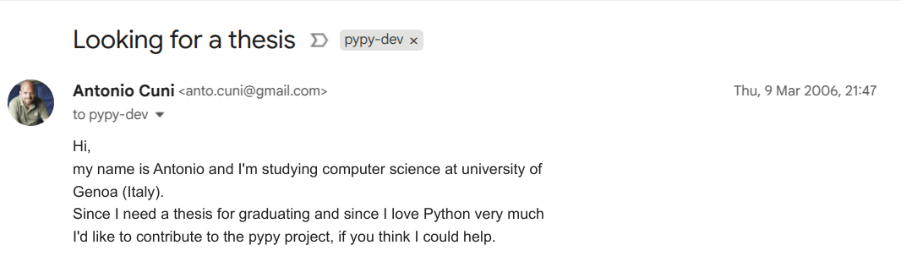

# My first OSS commit turns 20 today


Some time ago I realized that it was 20 years since I started to contribute to
Open Source. It's easy to remember, because I started to work on PyPy as part of my
master's thesis and I graduated in 2006.

So, I did a bit of archeology to find the [first commit](https://github.com/pypy/pypy/commit/1a086d45d9):

```autorun
$ cd ~/pypy/pypy && git show 1a086d45d9 --no-patch
commit 1a086d45d9
Author: Antonio Cuni <anto.cuni@gmail.com>
Date:   Wed Mar 22 14:01:42 2006 +0000

    Initial commit of the CLI backend
```

!!! note "svn, hg, git"

    Funny thing, the original commit was not in `git`, which was just a few months old
    at the time. In 2006 PyPy was using `subversion`, then a few years later [migrated
    to mercurial](../../2010/12/pypy-migrates-to-mercurial-3308736161543832134.md), and many years later
    [migrated to git](https://pypy.org/posts/2023/12/pypy-moved-to-git-github.html).

    I managed to find traces of the original `svn` commit in the archives of the
    [pypy-svn](https://marc.info/?l=pypy-svn&m=118495688023240) mailing list.

<!-- more -->

The first *interaction* with the PyPy team is actually [a couple of weeks earlier](https://www.mail-archive.com/pypy-dev@codespeak.net/msg01588.html):



Sending that email was probably one of the best and most influential decisions of my
life: after that I started to work on PyPy, participated in my first
[EuroPython](https://www.europython-society.org/europython/#europython-2006), moved to
Düsseldorf to continue working on PyPy, went back home, got my PhD, moved to Düsseldorf
and back *again*, did many years of freelancing thanks to my OSS experience, spoke at
many conferences, met hundreds of wonderful people and had countless beers with them,
moved to Berlin to join Anaconda and then did the Germany->Italy route for the 3rd time.
Phew, 20 years of life in a few lines!

During my years in Berlin, I started [SPy](https://github.com/spylang/spy) and met my
wife.  Deciding what is the most important of these two facts is left as an exercise to
the readers :).

So yes, contributing to Open Source turned out to be not a bad decision.

**Happy birthday, commit `1a086d45d9`** 🎉.
