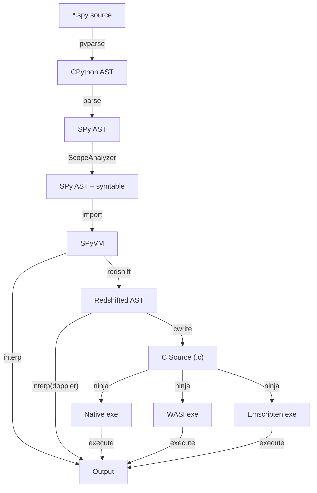

# Inside SPy 🥸, part 2: Language semantics

<!-- spy git commit: e5a8d272 -->

This is the second post of the *Inside SPy* series. The [first
post](../../2025/10-spy-motivations-and-goals/index.md) was mostly about motivations and
goals of SPy. This post will cover in more detail the semantics of SPy, including the
parts which makes it different from CPython.

We will talk about phases of execution, *colors*, redshifting, the very peculiar way
SPy implements static typing, and we will start to dive into metaprogramming.

!!! Success ""
    Before diving in, I want to express my gratitude to my employer,
    [Anaconda](https://www.anaconda.com/), for giving me the opportunity to dedicate
    100% of my time to this open-source project.


<!-- more -->

## Motivation and goals, recap

!!! warning "Shameless plug: give SPy a star ⭐"

    I admit I never cared much about GitHub stars, but it looks like nowadays it's what
    you need to be [considered
    important](https://claude.com/contact-sales/claude-for-oss). We are at 678 stars at
    the moment of writing, [let's try](https://github.com/spylang/spy) to get to 5000!

[Part 1](../../2025/10-spy-motivations-and-goals/index.md) describes motivations and
goals in great detail, but let's do a quick recap.

The main motivation is to make Python faster; by "faster" I mean comparable to C, Rust
and Go.  After spending 20 years in this problem space, I am convinced that it's
impossible to achieve such a goal without breaking compatibility.

The second motivation is that static typing is playing a more and more important role in
the Python community, but Python is not a language designed for that, which leads to a
[suboptimal
experience](../../2025/10-spy-motivations-and-goals/index.md#static-typing-in-python).

There are two possible definitions of SPy; both of them are accurate, although from very
different perspectives:

> SPy is an interpreter _and_ a compiler for a **statically typed variant** of Python,
> with focus on performance.

and:

> SPy is a thought experiment to determine how much dynamicity we can remove from Python
> while still feeling Pythonic.

The part about "interpreter **and** compiler" is fundamental: the interpreter is needed
for ease of development and debugging, the compiler is needed for speed. The job of SPy
is to ensure that the two pieces have the exact same semantics so that the compilation
step is just a transparent speedup.

100% compatibility with Python is **explicitly not a goal**.  [The Zen of
SPy](../../2025/10-spy-motivations-and-goals/index.md#the-zen-of-spy) contains the goals
and design guidelines of SPy. This is a shortened version, see the link for full
details:

  1. Easy to use and implement.

  2. We have an interpreter.

  3. We have a compiler.

  4. Static typing.

  5. Performance matters.

  6. Predictable performance.

  7. Rich metaprogramming capabilities.

  8. Zero cost abstractions.

  9. Opt-in dynamism.

 10. One language, two levels.

Now, time to dive deeper into the language.

!!! note "SPy version"

    At the moment of writing SPy is still changing very rapidly and it's very likely that some of the examples will break in the future. We don't have any official release yet, but all the following examples have been tried on [SPy commit e5a8d272](https://github.com/spylang/spy/tree/e5a8d272)

## Compilation pipeline

Some of the design choices are better understood by taking into consideration how the
interpreter and the compiler works.

This is a diagram representing the compilation pipeline:



!!! note "`parse` vs `pyparse`"

    Why do we have two separate parsing steps? At the moment we rely on CPython parser:
    `pyparse` converts the source code into CPython AST. Then the `parse` step convers CPython AST into [SPy AST](https://github.com/spylang/spy/blob/e5a8d272/spy/ast.py).

    Eventually SPy will have its own parser and thus we will be able to drop `pyparse`.


The first few step up to and including `ScopeAnalyzer` are classical compiler
stages. Contrarily to CPython, SPy doesn't produce bytecode. In SPy, executable code is
kept in form of AST, which is then transformed during the various stages of the
pipeline. **SPy AST is used as the internal IR of both the compiler and the
interpreter**.

!!! note "AST vs bytecode"

    Why using the AST instead of a bytecode as CPython does?

    The main advantage of direct AST interpretation is that it's simpler and easier to
    implement; bytecode-based execution is more complex because you need both the
    bytecode compiler and the bytecode VM but tends to be faster to execute. This
    tradeoff makes a lot of sense for CPython, where bytecode is the only mean of
    execution but less for SPy where we also have a C backend.

    That said, the long term goal for SPy's interpreter is to have performance
    comparable to CPython.

    In the very early days of the project, SPy was bytecode based. Then
    [PR #4](https://github.com/spylang/spy/pull/4) switched to the AST interpreter and we
    never looked back. Having an AST-based IR makes it **much** simpler to implement
    [Redshifting](#redshifting) and the C backend.


The `import` step is interesting: it imports the given module **and all its
dependencies** in the running `SPyVM` instance.  The dependencies are determined and
resolved statically, by scanning for the presence of `import` statements, recursively.
This means that **all needed modules** are imported eagerly, including e.g. those who
are imported solely inside function bodies (and even if those functions are never
executed).

This is a big departure from CPython semantics, but it is also an essential part to
enable many important features of SPy. We will talk more about it later in this series.

After `import`, we can run the code in three different modes:

- **interpreted mode**: the untyped AST is executed as is by the interpreter.

- **compiled mode**: in this mode we first apply **redshift** to transform _untyped AST_
  into _typed AST_, which is easier to compile. Then we feed the typed AST to the C
  backend, which produces C code, which is finally compiled by `gcc`, `clang` or any
  other C compiler. Multiple targets are supported, including native, WASM/WASI and
  Emscripten.

- **doppler mode**: the typed ASTs produced by **redshift** are executed by the
  interpreter. This is mostly used by tests to ensure that the redshift pass produces
  correct code.


!!! note "Why C code and not LLVM?"

    At this stage we are trying to optimize for time to market. Emitting C code is much
    simpler, easier to develop and easier to debug, while still getting performance which
    are comparable to LLVM.

    Moreover, by using C as the commond ground we automatically have lots of great
    existing tools at our disposal, like debuggers, profilers, build systems, etc.  And
    using C makes it very easy to target new platforms such as e.g. emscripten.


## Phases of execution and hello world

From the point of view of the user, SPy code runs in three distinct **execution
phases**:

1. **Import time**: this is when we run all the module-level code, including global
   variable initializers, decorators, metaclasses, etc.. After this phase, **all the
   globals are frozen**.

2. **Redshift**: during this phase we apply partial evaluation to all expressions that
   are safe to be evaluated eagerly.  This is an optional phase which happens only
   during compilation or when explicitly requested.  The presence/absence of redshift
   **should not have any visible effects** on the behavior of the program.

3. **Runtime**: the actual execution of the program, starting from a `main` function.

In **interpreted mode**, the interpreter runs "Import time" and then "Runtime".

In **doppler mode** the interpreter runs "Import time"; then "Redshift" produces typed
ASTs, which are executed by the interpreter.

In **compiled mode**, the interpreter runs "Import time"; then "Redshift" produces typed
ASTs, which are translated into C and compiled into an executable. The executable runs
the "Runtime".

Contrarily to Python, the main entry point of a program is not module-level code, but
it's the `main` function. This is needed because as we saw above, module level code is
always executed "at compile time".

Thus, this is the hello world in SPy:

```python title="hello.spy" autowrite
def main() -> None:
    print("Hello world!")
```

We can run it in interpreted mode, as we would do in Python:

```autorun
$ spy hello.spy
Hello world!
```

!!! note "The SPy playground"

    The [SPy playground](https://spylang.github.io/spy) is a PyScript based app which
    you can use to try SPy directly in the browser.  The version linked in this box is
    the official one which tracks the latest git `main` branch. However, all the code
    snippets on this page have a `Try it yourself` button which opens the example into a
    SPy playground pinned to commit `e5a8d272`.

We can do redshifting and inspect the transformed version. By default `spy redshift` (or
`spy rs`) have a pretty printer which shows typed AST in source code form, which is
easier to read. In this case the redshifted version is very similar to the original, but
e.g. we can see that `print` has been specialized to `print_str`:

```autorun
$ spy redshift hello.spy
def main() -> None:
    print_str('Hello world!')
```

We can do redshifting **and execute** the code. This is equivalent to the doppler mode
described above:

```autorun
$ spy redshift -x hello.spy
Hello world!
```


Finally, we can build an executable:

```autorun
$ spy build hello.spy
[debug] build/hello

$ ./build/hello
Hello world!
```

If you are curious, you can have a look at the generated C code. We will talk in depth
about it later during this series:

```autorun
$ tail -10 build/src/hello.c | pygmentize -l C -f terminal
// content of the module

int main(void) {
    spy_hello$main();
    return 0;
}
#line SPY_LINE(1, 18)
void spy_hello$main(void) {
    spy_builtins$print_str(&SPY_g_str0 /* 'Hello world!' */);
}
```


By default, it compiles to debug mode for the `native` platform, but you can use
`--release` to switch to release mode and `--target` to select a different platform.

You can also use `spy build -x` to compile **and** automatically execute the resulting
binary.

## Static typing

In SPy, **type annotations are always enforced**. This is probably the biggest departure
from CPython semantics, which explicitly ignore type annotations at runtime. After all,
the **S** stands for static :).

```python title="type-error1.spy" autowrite
def main() -> None:
    x: int = "hello"
    print(x)
```

```autorun
$ spy type-error1.spy
Traceback (most recent call last):
  * type-error1::main at /.../autorun/type-error1.spy:2
  |     x: int = "hello"
  |              |_____|

TypeError: mismatched types
  | /.../autorun/type-error1.spy:2
  |     x: int = "hello"
  |              |_____| expected `i32`, got `str`

  | /.../autorun/type-error1.spy:2
  |     x: int = "hello"
  |        |_| expected `i32` because of type declaration


```

This also applies to e.g. function calls, `return` statements, etc.

Type annotations are **mandatory** for function arguments and return types. They are
optional for variables.  In that case, we do a very limited form of type inference and
automatically declare the variable using the type of its initializer.  We can use the
special function `STATIC_TYPE` to inspect it:

```python title="type-inference.spy" autowrite
def main() -> None:
    x = "hello"
    print(STATIC_TYPE(x))
```

```autorun
$ spy type-inference.spy
<spy type 'str'>
```

!!! note "Type annotation of `@blue` functions"

    Type annotations are mandatory only for "red" functions. For "blue" functions they
    are optional and they default to `dynamic`. We will talk about this in the
    appropriate section.  `@blue` functions are explained [later](#blue-functions).

!!! note "`STATIC_TYPE`"

    Currently `STATIC_TYPE` has an uppercase name and lives in the `builtins` module,
    for historical reasons. This might change. One option is to move it to the special
    `__spy__` module and call it `static_type`.

## Operator dispatch

In SPy, as in Python, almost every syntactical form is turned into an operator call. So
e.g. `+` is equivalent to `operator.add`, `a.b` is equivalent to `getattr`, and in turn
they call the various `__add__`, `__getattr__`, etc.

Whereas in Python operator dispatch happens dynamically, in SPy it happens
statically. An example if worth 1000 words:

```python title="op_dispatch.spy" autowrite
def add_int(x: int, y: int) -> int:
    return x + y

def add_str(x: str, y: str) -> str:
    return x + y
```

```autorun
$ spy redshift --full-fqn op_dispatch.spy
def `op_dispatch::add_int`(x: `builtins::i32`, y: `builtins::i32`) -> `builtins::i32`:
    return `operator::i32_add`(x, y)

def `op_dispatch::add_str`(x: `builtins::str`, y: `builtins::str`) -> `builtins::str`:
    return `operator::str_add`(x, y)
```

Here we see that after redshifting, the generic `+` operators have been replaced by
concrete `i32_add` and `str_add` calls, which the C backend then replaces with direct
call to the appropriate function.

!!! note "FQNs and `--full-fqn`"

    FQN stands for Fully Qualified Name. It's an unique identifier assigned to every
    function, type and constant inside a running SPy VM.

    By default, `spy redshift` uses a special "pretty" output mode which is easier to
    read for humans and e.g. prints `i32` instead of `builtins::i32`, and `x + y`
    instead of `operator::i32_add(x, y)`.

    But the point of the example above was precisely to show the call to
    `operator::i32_add`: `--full-fqn` turns off pretty printing. Try to run
    `spy redshift op_dispatch.spy` and see the difference.


## Static vs dynamic types

Operator dispatch is based on **static types**. SPy distinguishes between static and
dynamic types of expression:

  - the **static type** is the type as known by the compiler;

  - the **dynamic type** (or just the "type") is the actual type of the concrete object
    in memory.

```python title="static-dynamic-types.spy" autowrite
def print_types(x: object) -> None:
    print(STATIC_TYPE(x))
    print(type(x))

def main() -> None:
    print_types(42)
    print("---")
    print_types("hello")
```

```autorun
$ spy static-dynamic-types.spy
<spy type 'object'>
<spy type 'i32'>
---
<spy type 'object'>
<spy type 'str'>
```

This has interesting consequences, and it's another big departure from Python. The
example below fails because the dispatch of `+` happen on the static type, which is
`object`:

```python title="type-error2.spy" autowrite
def add(x: object, y: object) -> object:
    return x + y

def main() -> None:
    print(add(1, 2))
```

```autorun
$ spy type-error2.spy
Traceback (most recent call last):
  * type-error2::main at /.../autorun/type-error2.spy:5
  |     print(add(1, 2))
  |           |_______|
  * type-error2::add at /.../autorun/type-error2.spy:2
  |     return x + y
  |            |___|

TypeError: cannot do `object` + `object`
  | /.../autorun/type-error2.spy:2
  |     return x + y
  |            ^ this is `object`

  | /.../autorun/type-error2.spy:2
  |     return x + y
  |                ^ this is `object`

  | /.../autorun/type-error2.spy:2
  |     return x + y
  |            |___| operator::ADD called here


```

It is possible to explicitly opt-in for dynamic dispatch by using the special type
`dynamic`:

```python title="dynamic_dispatch.spy" autowrite
def add(x: dynamic, y: dynamic) -> dynamic:
    return x + y

def main() -> None:
    print(add(1, 2))
    print(add("hello ", "world"))
```

```autorun
$ spy dynamic_dispatch.spy
3
hello world

$ spy redshift dynamic_dispatch.spy
def add(x: dynamic, y: dynamic) -> dynamic:
    return `operator::dynamic_add`(x, y)

def main() -> None:
    print_dynamic(`dynamic_dispatch::add`(1, 2))
    print_dynamic(`dynamic_dispatch::add`('hello ', 'world'))
```

The rationale is that dynamic dispatch is costly and prevents many other
optimization. By requiring an explicit opt-in, we can make sure that it's used only when
it's really needed without hurting the performance of "normal" code.

!!! tip "Current Status: `dynamic`"
    At the time of writing, `dynamic` works in the interpreter, but not yet in the
    compiler.

## Redshifting

Redshifting is a core concept of SPy to enable good performance without sacrificing
usability.  The core idea is that given a piece of code, there are parts of it that can
precomputed eagerly at compile time, leaving *less code* to run at runtime.  It's a form
of *partial evaluation*.

To do that, we introduce the concept of *color of an expression*: expressions whose value
is known at compile time are **blue**; expressions which must be evaluated at runtime
are **red**.  Examples of **blue** expressions are:

  1. literals, like `42` or `"hello"`;

  2. module-level constants;

  3. function calls if the **target function is known** at compile time, it's **pure**,
     and all the arguments are blue;

  4. function calls which are explicitly marked as `@blue`.

Examples of **red** expressions are:

  1. everything else :).

Let's start with a silly example:

```python title="rs1.spy" autowrite
def foo(x: int) -> int:
    return x + 2 * 3
```

We can see the colors and the result of redshifting by running `spy colorize`, and `spy
redshift`; `colorize` shows the **original** source code with colors; `redshift` shows
the redshifted source code:

```autorun
$ spy colorize rs1.spy
def foo(x: int) -> int:
    return x + 2 * 3

$ spy redshift rs1.spy
def foo(x: i32) -> i32:
    return x + 6
```

Notable things:

  - `2` and `3` are blue because they are literals;

  - `2 * 3` is blue because it's a pure operation between blue values;

  - `x + ...` is red because `x` is a function argument and thus unknown at compile
    time;

  - in the redshifted version, `2 * 3` has been replaced by `6`. This is a silly
    optimization which any compiler can do, but as we will see later redshifting is much
    more powerful than that.

Internally, redshifting operates on the AST (Abstract Syntax Tree). First, let's look at
the original AST; you can click on it to see the full interactive version:

```autorun
$ spy parse --format html rs1.spy
Written build/rs1_parse.html
```

```antocuni-popup
img: rs1_parse.svg
url: autorun/build/rs1_parse.html
```

It's a standard "textbook" AST: each node represent a binary operation, with `left` and
`right` children. Now let's look again at `spy colorize`, this time looking at the AST:

```autorun
$ spy colorize --format html rs1.spy
Written build/rs1_colorize.html
```

```antocuni-popup
img: rs1_colorize.svg
url: autorun/build/rs1_colorize.html
```

Finally, the redshifted version:

```autorun
$ spy redshift --format html rs1.spy
Written build/rs1_rs.html
```

```antocuni-popup
img: rs1_rs.svg
url: autorun/build/rs1_rs.html
```

During redshifting we find all the subtrees which are fully blue, and replace them with
a single constant node containing the result.  In this case, the whole subtree `2 * 3`
has been replaced by a single node `6`. This also explain **why it's called
redshifting**: because the resulting tree is "less blue" and the averge color "shifts to
the red".

Moreover, the remaining BinOp `x + 6` has been converted into a concrete call to
`i32_add` as we saw in the [Operator Dispatch](#operator-dispatch) section above. Note
that the node for `i32_add` is blue, because the **callee** is constant and known at
compile time, but the `Call` itself is red because the function will be called at
runtime.


## `@blue` functions

What we have seen so far it's a very complicated way to do simple numerical
optimizations, which is a bit underwhelming.  Redshifting becomes more interesting in
combination with `@blue` function.

These are functions which are **guaranteed** to be eagerly evaluated. It is mandatory
that all the arguments are blue as well, and the function is evaluated **by the
interpreter** during redshifting.

In the next sections we will see how they enable interesting metaprogramming patterns,
but let's start from a simple example first:

```python title="pi.spy" autowrite
from math import fabs

@blue
def get_pi() -> float:
    """
    Compute an approximation of PI using the Leibniz series
    """
    tol = 0.001
    pi_approx = 0.0
    k = 0
    term = 1.0  # Initial term to enter the loop

    while fabs(term) > tol:
        if k % 2 == 0:
            term = 1.0 / (2 * k + 1)
        else:
            term = -1 * 1.0 / (2 * k + 1)

        pi_approx = pi_approx + term
        k = k + 1

    return 4 * pi_approx


def main() -> None:
    pi = get_pi()
    print("pi:")
    print(pi)
```

```autorun
$ spy pi.spy
pi:
3.143588659585789

$ spy redshift pi.spy
def main() -> None:
    print_str('pi:')
    print_f64(3.143588659585789)
```

`get_pi` is a `@blue` function, and thus is evaluated at compile time. It's
completely removed from the redshifted output and it will never be seen by the C
backend. What is left after redshifting is just the `main` function with constant value.

!!! note "Is the compiler Turing complete?"

    In short: yes. `@blue` function can run arbitrary code, and thus potentially not
    even terminate.  From the purest theoretical Computer Science point of view, this is
    A Bad Thing.  However, Python shows that in practice it's less of a problem than you
    would think: after all, in Python, "import time" is also Turing complete,

    One possible way to deal with it is to give a certain amount of "computing power" to
    use use during import time and redshift: each operation decreaes the remaining power
    by one, if it reaches zero we abort.  However, we didn't feel the need to do that so
    far.

Things become more interesting when we create closures:


```python title="adder.spy" autowrite
@blue
def make_adder(n: int):
    def add(x: int) -> int:
        return x + n

    return add

add5 = make_adder(5)
add7 = make_adder(7)

def main() -> None:
    add9 = make_adder(9)
    print(add5(10))
    print(add7(10))
    print(add9(10))

    add5_again = make_adder(5)
    print(add5_again(10))
```

This example works "as expected": if you ignore the `@blue` decorator, it works exactly
as in CPython:

```autorun
$ spy adder.spy
15
17
19
15
```

However, `redshift` shows the magic:

```autorun
$ spy redshift adder.spy
add5 = `adder::make_adder::add`
add7 = `adder::make_adder::add#1`

def `adder::make_adder::add`(x: i32) -> i32:
    return x + 5

def `adder::make_adder::add#1`(x: i32) -> i32:
    return x + 7

def main() -> None:
    print_i32(`adder::make_adder::add`(10))
    print_i32(`adder::make_adder::add#1`(10))
    print_i32(`adder::make_adder::add#2`(10))
    print_i32(`adder::make_adder::add`(10))

def `adder::make_adder::add#2`(x: i32) -> i32:
    return x + 9
```

Each invocation of `make_adder` creates a *new* specialized copy of `add`, each bound to
a different value; each version is given an unique Fully Qualified Name (FQN).

`add5` and `add7` are created at module level, while `add9` is created inside the
`main`, but the end result is the same.  It's also worth to note that the second call to
`make_adder(5)` does **NOT** create yet another copy: `@blue` calls are automatically
memoized, thus subsequent calls with the same arguments reuse the previously computed
value.

!!! note "Where is `add9`?"

    We don't see any mention of `add9` in the redshifted version. This happens because
    `add9` is just a local variable of `main` which is optimized away, and the code
    contains a direct call to `make_adder::add#2`.

We can also have a look at the C code to confirm that each `add` is translated into a
specific C function:

```autorun
$ spy build adder.spy
[debug] build/adder

$ tail -24 build/src/adder.c | pygmentize -l C -f terminal
#line SPY_LINE(3, 18)
int32_t spy_adder$make_adder$add(int32_t x) {
    return x + 5;
    abort(); /* reached the end of the function without a `return` */
}
#line SPY_LINE(3, 23)
int32_t spy_adder$make_adder$add$1(int32_t x) {
    return x + 7;
    abort(); /* reached the end of the function without a `return` */
}
#line SPY_LINE(11, 28)
void spy_adder$main(void) {
    #line SPY_LINE(13, 30)
    spy_builtins$print_i32(spy_adder$make_adder$add(10));
    spy_builtins$print_i32(spy_adder$make_adder$add$1(10));
    spy_builtins$print_i32(spy_adder$make_adder$add$2(10));
    #line SPY_LINE(18, 34)
    spy_builtins$print_i32(spy_adder$make_adder$add(10));
}
#line SPY_LINE(3, 37)
int32_t spy_adder$make_adder$add$2(int32_t x) {
    return x + 9;
    abort(); /* reached the end of the function without a `return` */
}
```

As in Python, nested function can access names defined in the outer scope. If the outer
scope is a `@blue` function, those names are automatically blue.  We can see it clearly
by inspecting the AST of the nested `add`: the `n` node is blue.

```autorun
$ spy colorize -f html adder.spy
Written build/adder_colorize.html
```

```antocuni-popup
img: adder_colorize.svg
url: autorun/build/adder_colorize.html
```

## Type manipulation and generics

Types are first order values as in Python, and thus they can be freely manipulated by
`@blue` functions. Here, we build a different type-specialized versions of an `add`
function:

```python title="add_T1.spy" autowrite
@blue
def add(T: type):
    def impl(a: T, b: T) -> T:
        return a + b

    return impl

add_int = add(int)
add_str = add(str)

def main() -> None:
    print(add_int(2, 3))
    print(add_str("hello ", "world"))
```

!!! note "Why `add` doesn't have a return type?"

    Type annotations of parameters and return type of `@blue` functions are
    **optional**. If they are specified, then they are checked. If they are omitted,
    they default to `dynamic`.  So in the example above, if we try to call
    `add("hello")` we get a type error, but `add` can return an object of any type.

    This is just a pragmatic choice: when you use `@blue` function to do
    metaprogramming, the types become quickly very complex and writing the correct types
    become harder than just writing the code.

    If you have ever tried to write a non-trivial decorator in Python, you know the pain
    of spelling `typing.Callable[...stuff stuff stuff...]`. By defaulting to `dynamic`,
    SPy removes the need of that pain, **without compromising on type safety**: the
    signature of the function says `dynamic`, but since it's blue, the **concrete**
    value returned by each single invocation is fully known to the compiler. This means
    that if you do e.g. `add(int) + "hello"`, you get the appropriate **compile time**
    `TypeError` because you cannot add a function and a string.

    This is very different to what happens with Python type checkers, which stop doing
    any type checking on values annotated as `Any`.


Again, it works as expected:

```autorun
$ spy add_T1.spy
5
hello world
```

And `redshift` creates two specialized versions of `add`, one for ints and one for
strings:

```autorun
$ spy redshift add_T1.spy
add_int = `add_T1::add[i32]::impl`
add_str = `add_T1::add[str]::impl`

def `add_T1::add[i32]::impl`(a: i32, b: i32) -> i32:
    return a + b

def `add_T1::add[str]::impl`(a: str, b: str) -> str:
    return `operator::str_add`(a, b)

def main() -> None:
    print_i32(`add_T1::add[i32]::impl`(2, 3))
    print_str(`add_T1::add[str]::impl`('hello ', 'world'))
```

This is how SPy does **generics**: a generic function is a `@blue` function which take
one or more types and/or values, and create a specialized nested function (same for
generic types, which we will see later in the series).

However, we would like to write `add[int]` instead of `add(int)`, because this is the
way generics are normally spelled in Python. We can achieve that by using the decorator
`@blue.generic`:

```python title="add_T2.spy" autowrite
@blue.generic
def add(T: type):
    def impl(a: T, b: T) -> T:
        return a + b
    return impl

def main() -> None:
    print(add[int](2, 3))
    print(add[str]("hello ", "world"))
```

```autorun
$ spy add_T2.spy
5
hello world

$ spy redshift add_T2.spy
def main() -> None:
    print_i32(`add_T2::add[i32]::impl`(2, 3))
    print_str(`add_T2::add[str]::impl`('hello ', 'world'))

def `add_T2::add[i32]::impl`(a: i32, b: i32) -> i32:
    return a + b

def `add_T2::add[str]::impl`(a: str, b: str) -> str:
    return `operator::str_add`(a, b)
```

!!! note "`@blue` vs `@blue.generic`"

    The **only** difference between the two decorators is that `@blue` creates a blue
    function which is called via parentheses, while `@blue.generic` creates a blue
    function which is valled via square bracket. Apart that, they behave exactly the
    same.

    In particular, there is no limitation w.r.t. types of arguments and return
    type. Generic function can take as many arguments as they want, of any type, and
    they can return objects of any type.

!!! tip "Current status: PEP 695 - Type parameter syntax"

    [PEP 695](https://peps.python.org/pep-0695/) introduced the "Type parameter syntax":
    ```python
    def func[T](a: T, b: T) -> T:
        ...
    ```

    In SPy, this is just **syntax sugar** for `@blue.generic`. The line above is
    equivalent to:
    ```python
    @blue.generic
    def func(T):
        def impl(a: T, b: T) -> T:
            ...
        return impl
    ```
    However, at the moment of writing it has not been implemented yet.

## Operator dispatch, revisited.

Now that we know about `@blue` functions, we can understand better how operator dispatch
works. We remember from [the previous section](#operator-dispatch) that e.g. `str + str`
is dispached to `operator::str_add`.

How to we go from `a + b` to `operator::str_add(a, b)`?  Internally, operator dispatch
happens in two steps:

  1. first, we determine the implementation function (or **opimpl**) for the given types

  2. then, we call the opimpl with the actual values.

In pseudocode, `a + b` becomes:
```python
from operator import ADD

# x = a + b
Ta = STATIC_TYPE(a)
Tb = STATIC_TYPE(b)
opimpl = ADD(Ta, Tb)
x = opimpl(a, b)
```

The trick is that `STATIC_TYPE` and `ADD` are both `@blue` functions, so during
redshifting they are partially evaluated away, leaving just `opimpl(a, b)`.

Normally `operator.ADD` is automaticaly called by the interpreter, but we can also call it manually:
```python title="op1.spy" autowrite
from operator import ADD

def main() -> None:
    fn1 = ADD(i32, i32)
    fn2 = ADD(str, str)
    print(fn1)
    print(fn2)
```

```autorun
$ spy op1.spy
<OpImpl `def(i32, i32) -> i32` for `operator::i32_add`>
<OpImpl `def(str, str) -> str` for `operator::str_add`>
```

In reality, `ADD` doesn't receive the *types* of the operand: it receive objects which
*describes* the operands: this description include the static type, but also e.g. the
source code location of the expression, the color and the concrete value if it's `blue`.

These "argument description" objects are called **meta args**. A function which takes
meta args end returns an opimpl is a **meta function**.

As in Python, custom types can override dunder methods like `__add__`, `__getitem__`,
`__getattr__`, etc., and they can implement them either as normal function or as meta
functions.  This is a very powerful mechanism which unlocks lots of opportunities.

For example, take [`list.__getitem__`](https://github.com/spylang/spy/blob/e5a8d272/stdlib/_list.spy#L81-L130): it's a meta function which checks the static type
of the index, and then dispatches to specialized opimpls like `getitem_int` or
`getitem_slice`.

Meta functions are a very advanced concept. Describing them in depth will be the topic
of a subsequent blog post.

## Static typing as a special case of `@blue` evaluation

Now, if we try to add two unrelated things, we get an error:

```python title="op2.spy" autowrite
def main() -> None:
    x = 1 + "hello"
    print(x)
```

```autorun
$ spy op2.spy
Traceback (most recent call last):
  * op2::main at /.../autorun/op2.spy:2
  |     x = 1 + "hello"
  |         |_________|

TypeError: cannot do `i32` + `str`
  | /.../autorun/op2.spy:2
  |     x = 1 + "hello"
  |         ^ this is `i32`

  | /.../autorun/op2.spy:2
  |     x = 1 + "hello"
  |             |_____| this is `str`

  | /.../autorun/op2.spy:2
  |     x = 1 + "hello"
  |         |_________| operator::ADD called here


```

From the error message we see that the `TypeError` is raised by `operator.ADD`, which we
know being a `@blue` function.  This directly leads us to this important property: in
SPy, **compilation errors are errors which are raised from @blue functions**.

Now, consider this other example. If we run in the interpreter, it works fine because
`add` is never called:

```python title="op3.spy" autowrite
def add(x: int, y: str) -> int:
    return x + y

def main() -> None:
    print("hello")
```

```autorun
$ spy op3.spy
hello
```

However, if we try to `build` or `redshift` it, we get an error:

```autorun
$ spy redshift op3.spy
Static error during redshift:
Traceback (most recent call last):
  * [redshift] op3::add at /.../autorun/op3.spy:2
  |     return x + y
  |            |___|

TypeError: cannot do `i32` + `str`
  | /.../autorun/op3.spy:2
  |     return x + y
  |            ^ this is `i32`

  | /.../autorun/op3.spy:2
  |     return x + y
  |                ^ this is `str`

  | /.../autorun/op3.spy:2
  |     return x + y
  |            |___| operator::ADD called here


```

This happens because all `@blue` calls are evaluated eagerly during redshifting,
including the implicit `operator.ADD`.

This also means that we can **programmatically generated compilation errors** by raising
the appropriate exceptions from `@blue` functions:

```python title="smallstring.spy" autowrite
@blue.generic
def SmallString(size: int):
    if size > 32:
        raise StaticError("SmallString must be at most 32 chars")
    return str # just kidding :)

def say_hello(name: SmallString[64]) -> None:
    print(name)

def main() -> None:
    pass
```

```autorun
$ spy build smallstring.spy
Traceback (most recent call last):
  * [module] smallstring at /.../autorun/smallstring.spy:7
  | def say_hello(name: SmallString[64]) -> None:
  |                     |_____________|
  * smallstring::SmallString at /.../autorun/smallstring.spy:4
  |         raise StaticError("SmallString must be at most 32 chars")
  |         |_______________________________________________________|

StaticError: SmallString must be at most 32 chars

```

Note that it's a real **compile time** error, as it is raised at `build` time even if
`say_hello` it's never called.


## Powerful metaprogramming with `@blue` functions

We can do arbitrary operations on blue values, and we have the full power of the
language at blue time.  This makes it possible to write very interesting code: for
example, this is a revised version of `make_adder`, which works for *arbitrary types*:
the blue function dynamically get the type `T` of the argument and then uses it in the
signature of the nested function:

```python title="meta1.spy" autowrite
@blue
def make_adder(y: dynamic):
    T = type(y)
    def add(x: T) -> T:
        return x + y

    return add

add_world = make_adder(" world")
add5 = make_adder(5)

def main() -> None:
    print(STATIC_TYPE(add_world))
    print(add_world("hello"))
    print("---")
    print(STATIC_TYPE(add5))
    print(add5(2))

```

```autorun
$ spy meta1.spy
<spy type 'def(str) -> str'>
hello world
---
<spy type 'def(i32) -> i32'>
7
```

Redshifted version:

```autorun
$ spy redshift meta1.spy
add_world = `meta1::make_adder::add`
add5 = `meta1::make_adder::add#1`

def `meta1::make_adder::add`(x: str) -> str:
    return `operator::str_add`(x, ' world')

def `meta1::make_adder::add#1`(x: i32) -> i32:
    return x + 5

def main() -> None:
    print_str("<spy type 'def(str) -> str'>")
    print_str(`meta1::make_adder::add`('hello'))
    print_str('---')
    print_str("<spy type 'def(i32) -> i32'>")
    print_i32(`meta1::make_adder::add#1`(2))
```

It is important to underline that **typechecking is fully aware of blue semantics**,
meaning that the SPy compiler can keep track of the precise type of `add5` and
`add_world` by construction, without any special support. By the time the typechecker
runs, all the blue values are fully known.  This is a big improvements over classical
type checkers for Python which typically cannot understand metaprogramming patterns, or
they have ad-hoc support only for some.

Inside `@blue` functions we can use the full power of the language. Imagine that we want
to "optimize" `make_adder(0)`: instead of adding 0, we can just return the identity
function. This is obviously a silly example, but hopefully it gives the idea.

The problem is: how do we know what is the "zero" value since we are coding for a
generic type `T`? For example, for ints it's `0`, but for strings is `""`.

This is a possible solution:

```python title="meta2.spy" autowrite
@blue.generic
def zero(T):
    "Return the 'zero' value for the given type"
    if T == int:
        return 0
    elif T == str:
        return ""
    else:
        return None


@blue.generic
def identity(T):
    def impl(x: T) -> T:
        return x
    return impl

@blue
def make_adder(y: dynamic):
    T = type(y)
    z = zero[T]

    if z is not None and y == z:
        # use the identity function instead of doing + 0, for "efficiency"
        return identity[T]

    else:
        # general case
        def add(x: T) -> T:
            return x + y

        return add

def main() -> None:
    adds = make_adder(" world")
    add0 = make_adder(0)
    print(adds("hello"))
    print(add0(2))
```

After redshift, we can see that `add0` is actually `identity[i32]`:

```autorun
$ spy redshift meta2.spy
def main() -> None:
    print_str(`meta2::make_adder::add`('hello'))
    print_i32(`meta2::identity[i32]::impl`(2))

def `meta2::make_adder::add`(x: str) -> str:
    return `operator::str_add`(x, ' world')

def `meta2::identity[i32]::impl`(x: i32) -> i32:
    return x
```

This is just a hint of the metaprogramming capabilities of SPy. We will see more
interesting examples later in the series.

!!! note "Metaprogramming in other languages"

    SPy is surely not the only language to allow metaprogramming. In C++ you can achieve
    similar goals by using *template metaprogramming*: the biggest drawback is that when
    using C++ templates in that way, you are effectively doing the metaprogramming part
    in a different language, and moreover C++ templates are infamous for their obscure
    error messages.

    Another language which is much closer to SPy is Zig: Zig's `comptime` is very
    similar to SPy's `@blue`.  The big difference in this case is in the implementation
    and in development experience: Zig is only compiled, and `comptime` evaluation
    happens at... well, compilation time. In SPy, `@blue` functions are evaluated by the
    interpreter, with all the usual advantages. For example, you can totally insert a
    `breakpoint()` in a `@blue` function to do step-by-step debugging.


## Next steps

There is still a lot to talk about, but this post is already too long. In the next
post(s) of the series we will talk about things like:

  - compile-time decorators;

  - advanced metaprogramming patters;

  - blue-time support for `__dunder__` methods, including `__getattr__`, `__setattr__`
    and the descriptor protocol;

  - low-level memory management and the `unsafe` module;

  - custom types and `@struct`;

  - how to use all of this to build zero costs high level abstractions from low-level
    constructs.

For those who are curious, I suggest to have a look at the
[stdlib](https://github.com/spylang/spy/tree/main/stdlib). In particular, the builtin types [`list`](https://github.com/spylang/spy/blob/e5a8d27282b7825031ca2134aef92e6fba649393/stdlib/_list.spy), [`dict`](https://github.com/spylang/spy/blob/e5a8d27282b7825031ca2134aef92e6fba649393/stdlib/_dict.spy) and [`tuple`](https://github.com/spylang/spy/blob/e5a8d27282b7825031ca2134aef92e6fba649393/stdlib/_tuple.spy) are implemented **in pure SPy**.
