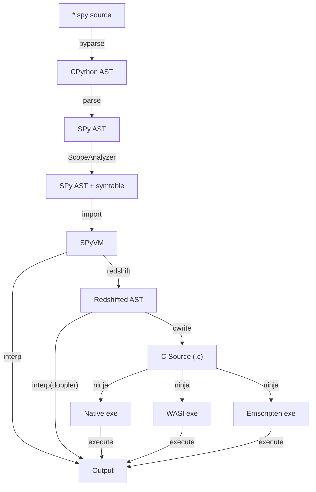

# Inside SPy🥸, part 2: Language semantics

This is the second post of the *Inside SPy* series. The [first
post](../../2025/10-spy-motivations-and-goals/index.md) was mostly about motivations and
goals of SPy. This post will cover more in detail the semantics of SPy, including the
parts which makes it different that CPython.

XXX write something more here.

!!! Success ""
    Before diving in, I want to express my gratitude to my employer,
    [Anaconda](https://www.anaconda.com/), for giving me the opportunity to dedicate
    100% of my time to this open-source project.


<!-- more -->

## Motivation and goals, recap

[Part 1](../../2025/10-spy-motivations-and-goals/index.md) describes motivations and
goals in great detail, but let's do a quick recap.

The main motivation is to make Python faster; by "faster" I mean comparable to C, Rust
and Go.  After spending 20 years in this problem space, I am convinced that it's
impossible to achieve such a goal without breaking compatibility.

The second motivation is that static typing is playing a more and more important role in
the Python community, but Python is not a language designed for that, which leads to a
[suboptimal
experience](../../2025/10-spy-motivations-and-goals/index.md#static-typing-in-python).

There are two possible definitions of SPy; both of them are accurate, although from very
different perspectives:

> SPy is an interpreter _and_ a compiler for a **statically typed variant** of Python,
> with focus on performance.

and:

> SPy is a thought experiment to determine how much dynamicity we can remove from Python
> while still feeling Pythonic.

The part about "interpreter **and** compiler" is fundamental: the interpreter is needed
for ease of development and debugging, the compiler is needed for speed. The job of SPy
is to ensure that the two pieces have the exact same semantics so that the compilation
step is just a transparent speedup.

100% compatibility with Python is **explicitly not a goal**.  [The Zen of
SPy](../../2025/10-spy-motivations-and-goals/index.md#the-zen-of-spy) contains the goals
and design guidelines of SPy. This is a shortened version, see the link for full
details:

  1. **Easy to use and implement**.

  2. We have an **interpreter**.

  3. We have a **compiler**.

  4. **Static typing**.

  5. **Performance matters**.

  6. **Predictable performance**.

  7. **Rich metaprogramming capabilities**.

  8. **Zero cost abstractions**.

  9. **Opt-in dynamism**.

 10. **One language, two levels**.

Now, time to dive deeper into the language.

!!! note "SPy version"

    At the moment of writing SPy is still changing very rapidly and it's very likely that some of the examples will break in the future. We don't have any official release yet, but all the following examples have been tried on [SPy commit bb3e0292](https://github.com/spylang/spy/tree/bb3e0292)

## Compilation pipeline

Some of the design choices are better understood by taking into consideration how the
interpreter and the compiler works.

This is a diagram representing the compilation pipeline:



!!! note "`parse` vs `pyparse`"

    Why do we have two separate parsing steps? At the moment we rely on CPython parser:
    `pyparse` converts the source code into CPython AST. Then the `parse` step convers CPython AST into [SPy AST](https://github.com/spylang/spy/blob/bb3e0292/spy/ast.py).

    Eventually SPy will have its own parser and thus we will be able to drop `pyparse`.


The first few step up to and including `ScopeAnalyzer` are classical compiler
stages. Contrarily to CPython, SPy doesn't produce bytecode. In SPy, executable code is
kept in form of AST, which is then transformed during the various stages of the
pipeline. **SPy AST is used as the internal IR of both the compiler and the
interpreter**.

The `import` step is interesting: it imports the given module **and all its
dependencies** in the running `SPyVM` instance.  The dependencies are determined and
resolved statically, by scanning for the presence of `import` statements, recursively.
This means that **all needed modules** are imported eagerly, including e.g. those who
are imported solely inside function bodies (and even if those functions are never
executed).

This is a big departure from CPython semantics, but it is also an essential part to
enable many important features of SPy. We will talk more about it in the [relevant
section](...).


After `import`, we can run the code in thre different modes:

- **interpreted mode**: the untyped AST is executed as is by the interpreter.

- **compiled mode**: in this mode we first apply **redshift** to transform _untyped AST_
  into _typed AST_, which is easier to compile. Then we feed the typed AST to the C
  backend, which produces C code, which is finally compiled by `gcc`, `clang` or any
  other C compiler. Multiple targets are supported, including native, WASM/WASI and
  Emscripten.

- **doppler mode**: the typed ASTs produced by **redshift** are executed by the
  interpreter. This is mostly used by tests to ensure that the redshift pass produces
  correct code.


!!! note "Why C code and not LLVM?"

    At this stage we are trying to optimize for time to market. Emitting C code is much
    simpler, easier to develop and easier to debug, while still getting performance which
    are comparable or better than LLVM.

    Moreover, by using C as the commond ground we automatically have lots of great
    existing tools at our disposal, like debuggers, profilers, build systems, etc.  And
    using C makes it very easy to target new platforms such as e.g. emscripten.


## Phases of execution and hello world

From the point of view of the user, SPy code runs in three distinct **execution
phases**:

1. Import time: this is when we run all the module-level code, including global variable
   initializers, decorators, metaclasses, etc.

2. Redshift: during this phase we apply partial evaluation to all expressions are safe
   to be evaluated eagerly.  This is an optional phase which happens only during
   compilation or when explicitly requested.  The presence/absence of redshift **should
   not have any visible effects** on the behavior of the program.

3. Runtime: the actual execution of the program, starting from a `main` function.

In **interpreted mode**, the interpreter runs "Import time" and then "Runtime".

In **doppler mode** the interpreter runs "Import time"; then "Redshift" produces typed
ASTs, which are executed by the interpreter.

In **compiled mode**, the interpreter runs "Import time"; then "Redshift" produces typed
ASTs, which are translated into C and compiled into an executable. The executable runs
the "Runtime".

Contrarily to Python, the main entry point of a program is not module-level code, but
it's the `main` function. This is needed because as we saw above, module level code is
always executed "at compile time".

Thus, this is the hello world in SPy:

```python
# filename: hello.spy

def main() -> None:
    print("Hello world!")
```

We can run it in interpreted mode, as we would do in Python:

```autorun
$ spy hello.spy
Hello world!
```

We can do redshifting and inspect the transformed version. By default `spy redshift` (or
`spy rs`) have a pretty printer which shows typed AST in source code form, which is
easier to read. In this case the redshifted version is very similar to the original, but
e.g. we can see that `print` has been specialized to `print_str`:

```autorun
$ spy redshift hello.spy
def main() -> None:
    print_str('Hello world!')
```

We can do redshifting **and execute** the code. This is equivalent to the doppler mode
described above:

```autorun
$ spy redshift -x hello.spy
Hello world!
```


Finally, we can build an executable:

```autorun
$ spy build hello.spy
[debug] build/hello
$ ./build/hello
Hello world!
```

If you are curious, you can have a look at the generated C code. We will talk in depth
about it later during this series:

```autorun
$ tail -10 build/src/hello.c | pygmentize -l C -f terminal
// content of the module

int main(void) {
    spy_hello$main();
    return 0;
}
#line SPY_LINE(2, 18)
void spy_hello$main(void) {
    spy_builtins$print_str(&SPY_g_str0 /* 'Hello world!' */);
}
```


By default, it compiles to debug mode for the `native` platform, but there are flags to
switch to `--release` mode and to target a different platform.

You can also use `spy build -x` to compile **and** automatically execute the resulting
binary.

## Static typing

In SPy, **type annotations are always enforced**. This is probably the biggest departure
from CPython semantics, which explicitly ignore type annotations at runtime. After all,
the **S** stands for static :).

```python
# filename: type-error1.spy
def main() -> None:
    x: int = "hello"
    print(x)
```

```autorun
$ spy type-error1.spy
Traceback (most recent call last):
  * type-error1::main at /.../autorun/type-error1.spy:2
  |     x: int = "hello"
  |              |_____|

TypeError: mismatched types
  | /.../autorun/type-error1.spy:2
  |     x: int = "hello"
  |              |_____| expected `i32`, got `str`

  | /.../autorun/type-error1.spy:2
  |     x: int = "hello"
  |        |_| expected `i32` because of type declaration


```

This also applies to e.g. function calls, `return` statements, etc.

Type annotations are **mandatory** for function arguments and return types. They are
optional for variables.  In that case, we do a very limited form of type inference and
automatically declare the variable using the type of its initializer.  We can use the
special function `STATIC_TYPE` to inspect it:

```python
# filename: type-inference.spy
def main() -> None:
    x = "hello"
    print(STATIC_TYPE(x))
```

```autorun
$ spy type-inference.spy
<spy type 'str'>
```

!!! note "Type annotation of `@blue` functions"

    Type annotations are mandatory only for "red" functions. For "blue" functions they
    are optional and they default to `dynamic`. We will talk about this in the
    appropriate section.

!!! note "`STATIC_TYPE`"

    Currently `STATIC_TYPE` has an uppercase name and lives in the `builtins` module,
    for historical reasons. This might change. One option is to move it to the special
    `__spy__` module and call it `static_type`.

## Operator dispatch

In SPy, as in Python, almost every syntactical form is turned into an operator call. So
e.g. `+` is equivalent to `operator.add`, `a.b` is equivalent to `getattr`, etc., and in
turn they call the various `__add__`, `__getattr__`, etc.

Whereas in Python operator dispatch happens dynamically, in SPy it happens
statically. An example if worth 1000 words:

```python
# filename: op_dispatch.spy
def add_int(x: int, y: int) -> int:
    return x + y

def add_str(x: str, y: str) -> str:
    return x + y
```

```autorun
$ spy redshift --full-fqn op_dispatch.spy
def `op_dispatch::add_int`(x: `builtins::i32`, y: `builtins::i32`) -> `builtins::i32`:
    return `operator::i32_add`(x, y)

def `op_dispatch::add_str`(x: `builtins::str`, y: `builtins::str`) -> `builtins::str`:
    return `operator::str_add`(x, y)
```

Here we see that after redshifting, the generic `+` operators have been replaced by
concrete `i32_add` and `str_add` calls, which the C backend then replaces with direct
call to the appropriate function.

!!! note "FQNs and `--full-fqn`"

    FQN stands for Fully Qualified Name. It's an unique identifier assigned to every
    function, type and constant inside a running SPy VM.

    By default, `spy redshift` uses a special "pretty" output mode which is easier to
    read for humans and e.g. prints `i32` instead of `builtins::i32`, and `x + y`
    instead of `operator::i32_add(x, y)`.

    But the point of the example above was precisely to show the call to
    `operator::i32_add`: `--full-fqn` turns off pretty printing. Try to run
    `spy rs op_dispatch.spy` and see the difference.


## Static vs dynamic types

Operator dispatch is based on **static types**. SPy distinguishes between static and
dynamic types of expression:

  - the **static type** is the type as known by the compiler;

  - the **dynamic type** (or just the "type") is the actual type of the concrete object
    in memory.

```python
# filename: static-dynamic-types.spy
def print_types(x: object) -> None:
    print(STATIC_TYPE(x))
    print(type(x))

def main() -> None:
    print_types(42)
    print("---")
    print_types("hello")
```

```autorun
$ spy static-dynamic-types.spy
<spy type 'object'>
<spy type 'i32'>
---
<spy type 'object'>
<spy type 'str'>
```

This has interesting consequences, and it's another big departure from Python. The
example below fails because the dispatch of `+` happen on the static type, which is
`object`:

```python
# filename: type-error2.spy
def add(x: object, y: object) -> object:
    return x + y

def main() -> None:
    print(add(1, 2))
```

```autorun
$ spy type-error2.spy
Traceback (most recent call last):
  * type-error2::main at /.../autorun/type-error2.spy:5
  |     print(add(1, 2))
  |           |_______|
  * type-error2::add at /.../autorun/type-error2.spy:2
  |     return x + y
  |            |___|

TypeError: cannot do `object` + `object`
  | /.../autorun/type-error2.spy:2
  |     return x + y
  |            ^ this is `object`

  | /.../autorun/type-error2.spy:2
  |     return x + y
  |                ^ this is `object`

  | /.../autorun/type-error2.spy:2
  |     return x + y
  |            |___| operator::ADD called here


```

It is possible to explicitly opt-in for dynamic dispatch by using the special type
`dynamic`:

```python
# filename: dynamic_dispatch.spy
def add(x: dynamic, y: dynamic) -> dynamic:
    return x + y

def main() -> None:
    print(add(1, 2))
    print(add("hello ", "world"))
```

```autorun
$ spy dynamic_dispatch.spy
3
hello world
$ spy redshift dynamic_dispatch.spy
def add(x: dynamic, y: dynamic) -> dynamic:
    return `operator::dynamic_add`(x, y)

def main() -> None:
    print_dynamic(`dynamic_dispatch::add`(1, 2))
    print_dynamic(`dynamic_dispatch::add`('hello ', 'world'))
```

The rationale is that dynamic dispatch is costly and prevents many other
optimization. By requiring an explicit opt-in, we can make sure that it's used only when
it's really needed without hurting the performance of "normal" code.

!!! tip "Current Status: `dynamic`"
    At the time of writing, `dynamic` works in the interpreter, but not yet in the
    compiler.

## Redshifting

Redshifting is a core concept of SPy to enable good performance without sacrificing
usability.

The core idea is that given a piece of code, there are parts of it that can precomputed
eagerly at compile time, leaving *less code* to run at runtime.  It's a form of *partial
evaluation*.

To do that, we introduce the concept of *color of an expression*: **blue** expressions
are those whose value is known at compile time; **red** are those which must be
evaluated at runtime.

Examples of **blue** expressions are:

  1. literals, like `42` or `"hello"`;

  2. module-level constants;

  3. function calls **if** the target function is known at compile time, it's **pure**,
     and all the arguments are blue;

  4. function call which are explicitly marked as `@blue`

Examples of **red** expressions are:

  1. everything else :).

Let's start with a silly example:

```python
# filename: rs1.spy
def foo(x: int) -> int:
    return x + 2 * 3
```

We can see the colors and the result of redshifting by running `spy colorize`, and `spy
redshift`:

```autorun
$ spy colorize rs1.spy
def foo(x: int) -> int:
    return x + 2 * 3

$ spy redshift rs1.spy
def foo(x: i32) -> i32:
    return x + 6
```

Notable things:

  - `2` and `3` are blue because are literals

  - `2 * 3` is blue because it's a pure operation between blue values

  - `x + ...` is red because `x` is a function argument and thus unknown at compile
    time.

  - in the redshifted version, `2 * 3` has been replaced by `6`. This is a silly
    optimization which any compiler can do, but as we will see later redshifting is much
    more powerful than that.

Internally, redshifting operates on the AST (Abstract Syntax Tree). First, let's look at
the original AST:

```autorun
$ spy parse --format html rs1.spy
Written build/rs1_parse.html
```

<!-- antocuni-include-spyast: autorun/build/rs1_parse.html -->
