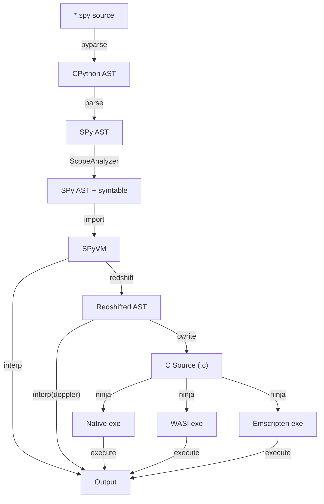

# Inside SPy🥸, part 2: Language semantics

This is the second post of the *Inside SPy* series. The [first
post](../../2025/10-spy-motivations-and-goals/index.md) was mostly about motivations and
goals of SPy. This post will cover more in detail the semantics of SPy, including the
parts which makes it different that CPython.

XXX write something more here.

!!! Success ""
    Before diving in, I want to express my gratitude to my employer,
    [Anaconda](https://www.anaconda.com/), for giving me the opportunity to dedicate
    100% of my time to this open-source project.


<!-- more -->

## Motivation and goals, recap

[Part 1](../../2025/10-spy-motivations-and-goals/index.md) describes motivations and
goals in great detail, but let's do a quick recap.

The main motivation is to make Python faster; by "faster" I mean comparable to C, Rust
and Go.  After spending 20 years in this problem space, I am convinced that it's
impossible to achieve such a goal without breaking compatibility.

The second motivation is that static typing is playing a more and more important role in
the Python community, but Python is not a language designed for that, which leads to a
[suboptimal
experience](../../2025/10-spy-motivations-and-goals/index.md#static-typing-in-python).

There are two possible definitions of SPy; both of them are accurate, although from very
different perspectives:

> SPy is an interpreter _and_ a compiler for a **statically typed variant** of Python,
> with focus on performance.

and:

> SPy is a thought experiment to determine how much dynamicity we can remove from Python
> while still feeling Pythonic.

The part about "interpreter **and** compiler" is fundamental: the interpreter is needed
for ease of development and debugging, the compiler is needed for speed. The job of SPy
is to ensure that the two pieces have the exact same semantics so that the compilation
step is just a transparent speedup.

100% compatibility with Python is **explicitly not a goal**.  [The Zen of
SPy](../../2025/10-spy-motivations-and-goals/index.md#the-zen-of-spy) contains the goals
and design guidelines of SPy. This is a shortened version, see the link for full
details:

  1. **Easy to use and implement**.

  2. We have an **interpreter**.

  3. We have a **compiler**.

  4. **Static typing**.

  5. **Performance matters**.

  6. **Predictable performance**.

  7. **Rich metaprogramming capabilities**.

  8. **Zero cost abstractions**.

  9. **Opt-in dynamism**.

 10. **One language, two levels**.

Now, time to dive deeper into the language.

!!! note "SPy version"

    At the moment of writing SPy is still changing very rapidly and it's very likely that some of the examples will break in the future. We don't have any official release yet, but all the following examples have been tried on [SPy commit 15179faa](https://github.com/spylang/spy/tree/15179faa70374af68affa772c015629473901736)

## Compilation pipeline

Some of the design choices are better understood by taking into consideration how the
interpreter and the compiler works.

This is a diagram representing the compilation pipeline:



!!! note "`parse` vs `pyparse`"

    Why do we have two separate parsing steps? At the moment we rely on CPython parser:
    `pyparse` converts the source code into CPython AST. Then the `parse` step convers CPython AST into [SPy AST](https://github.com/spylang/spy/blob/15179faa70374af68affa772c015629473901736/spy/ast.py).

    Eventually SPy will have its own parser and thus we will be able to drop `pyparse`.


The first few step up to and including `ScopeAnalyzer` are classical compiler
stages. Contrarily to CPython, SPy doesn't produce bytecode. In SPy, executable code is
kept in form of AST, which is then transformed during the various stages of the
pipeline. **SPy AST is used as the internal IR of both the compiler and the
interpreter**.

The `import` step is interesting: it imports the given module **and all its
dependencies** in the running `SPyVM` instance.  The dependencies are determined and
resolved statically, by scanning for the presence of `import` statements, recursively.
This means that **all needed modules** are imported eagerly, including e.g. those who
are imported solely inside function bodies (and even if those functions are never
executed).

This is a big departure from CPython semantics, but it is also an essential part to
enable many important features of SPy. We will talk more about it in the [relevant
section](...).


After `import`, we can run the code in thre different modes:

- **interpreted mode**: the untyped AST is executed as is by the interpreter.

- **compiled mode**: in this mode we first apply **redshift** to transform _untyped AST_
  into _typed AST_, which is easier to compile. Then we feed the typed AST to the C
  backend, which produces C code, which is finally compiled by `gcc`, `clang` or any
  other C compiler. Multiple targets are supported, including native, WASM/WASI and
  Emscripten.

- **doppler mode**: the typed ASTs produced by **redshift** are executed by the
  interpreter. This is mostly used by tests to ensure that the redshift pass produces
  correct code.


!!! note "Why C code and not LLVM?"

    At this stage we are trying to optimize for time to market. Emitting C code is much
    simpler, easier to develop and easier to debug, while still getting performance which
    are comparable or better than LLVM.

    Moreover, by using C as the commond ground we automatically have lots of great
    existing tools at our disposal, like debuggers, profilers, build systems, etc.  And
    using C makes it very easy to target new platforms such as e.g. emscripten.


## Phases of execution and hello world

From the point of view of the user, SPy code runs in three distinct **execution
phases**:

1. Import time: this is when we run all the module-level code, including global variable
   initializers, decorators, metaclasses, etc.

2. Redshift: during this phase we apply partial evaluation to all expressions are safe
   to be evaluated eagerly.  This is an optional phase which happens only during
   compilation or when explicitly requested.  The presence/absence of redshift **should
   not have any visible effects** on the behavior of the program.

3. Runtime: the actual execution of the program, starting from a `main` function.

In **interpreted mode**, the interpreter runs "Import time" and then "Runtime".

In **doppler mode** the interpreter runs "Import time"; then "Redshift" produces typed
ASTs, which are executed by the interpreter.

In **compiled mode**, the interpreter runs "Import time"; then "Redshift" produces typed
ASTs, which are translated into C and compiled into an executable. The executable runs
the "Runtime".

Contrarily to Python, the main entry point of a program is not module-level code, but
it's the `main` function. This is needed because as we saw above, module level code is
always executed "at compile time".

Thus, this is the hello world in SPy:

```python
# filename: hello.spy

def main() -> None:
    print("Hello world!")
```

We can run it in interpreted mode, as we would do in Python:

```autorun
$ spy hello.spy
Hello world!
```

We can do redshifting and inspect the transformed version. By default `spy redshift` (or
`spy rs`) have a pretty printer which shows typed AST in source code form, which is
easier to read. In this case the redshifted version is very similar to the original, but
e.g. we can see that `print` has been specialized to `print_str`:

```autorun
$ spy redshift hello.spy

def main() -> None:
    print_str('Hello world!')


```

We can do redshifting **and execute** the code. This is equivalent to the doppler mode
described above:

```autorun
$ spy redshift -x hello.spy
Hello world!
```


Finally, we can build an executable:

```autorun
$ spy build hello.spy
[debug] build/hello 
$ ./build/hello
Hello world!
```

By default, it compiles to debug mode for the `native` platform, but there are flags to
switch to `--release` mode and to target a different platform.

You can also use `spy build -x` to compile **and** automatically execute the resulting
binary.

## Static typing

In SPy, **type annotations are always enforced**. This is probably the biggest departure
from CPython semantics, which explicitly ignore type annotations at runtime. After all,
the S in SPy stands for static :).

```python
# filename: type-error1.spy
def main() -> None:
    x: int = "hello"
    print(x)
```

```autorun
$ spy type-error1.spy
Traceback (most recent call last):
  * type-error1::main at /home/antocuni/pypy/misc/antocuni.github.io/blog/posts/2026/03-spy-semantics/autorun/type-error1.spy:2
  |     x: int = "hello"
  |              |_____|

TypeError: mismatched types
  | /home/antocuni/pypy/misc/antocuni.github.io/blog/posts/2026/03-spy-semantics/autorun/type-error1.spy:2
  |     x: int = "hello"
  |              |_____| expected `i32`, got `str`

  | /home/antocuni/pypy/misc/antocuni.github.io/blog/posts/2026/03-spy-semantics/autorun/type-error1.spy:2
  |     x: int = "hello"
  |        |_| expected `i32` because of type declaration


```
